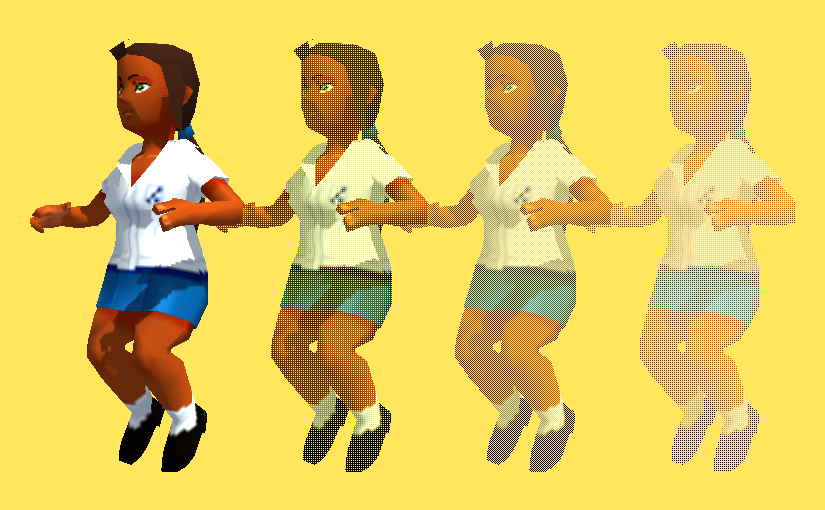
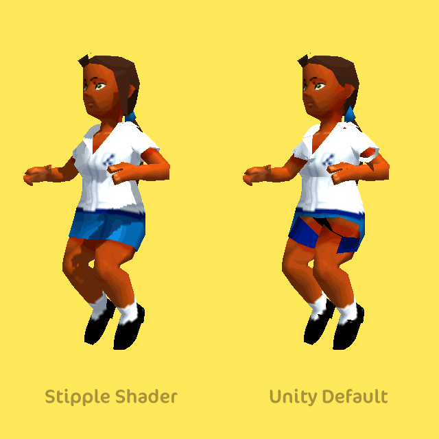

Transparency in 3D games is still really tough to get right. You want a shader that is cheap performance-wise, avoids order/sorting issues and works across different platforms/rendering pipelines. Stippling is an old-school solution that works perfectly in most cases. I’ve put together a Unity stipple implementation, which you can download and use however you like.

Stipple transparency (or Screen-door transparency, or dithered transparency) works by omitting drawing more and more pixels from the object as transparency increases. This is obviously not physically accurate in any way, but looks convincing enough for many cases.

Traditional alpha blending transparency has issues with sorting polygons, drawing shadows, functioning with deferred rendering, as well as with overlapping geometry on complex meshes (unless you invest in writing to the z-buffer), take a look at a comparison with the default Unity (as of 5.4) transparency:

I’ve searched for a while for a stipple/screen-door/dithering shader for Unity, but wasn’t able to find any results. In the end, I’ve decided to throw together one of my own. I was able to find an example in another engine in [an article by Digital Rune](https://www.digitalrune.com/Blog/Post/1743/Screen-Door-Transparency). I fixed it up to work in Unity’s shader language (you can’t access a matrix using a double index in Unity, what the heck?), here’s my diffuse version:

It’s worth mentioning that while the method this uses, called an alpha-test, is faster than alpha-blending in most cases, there appears to be a consensus that on iOS alpha-test is **slower** than alpha-blend. So if you plan to use this shader on mobile, do check in Xcode if the Unity stipple transparency shader is giving the results you’re after.

## Unity Stipple Shader Download

Here’s a Unitypackage with both the above diffuse shader and a standard shader variant, do whatever you like with it: [Download Version 1](https://ocias.com/blog/wp-content/uploads/2016/06/OciasStippleShadersV1.unitypackage)

I hope this helps you with your game, do let me know if you end up using it, or if you run into any problems!
