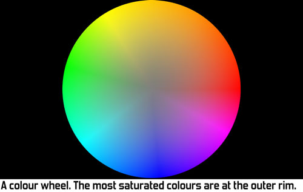
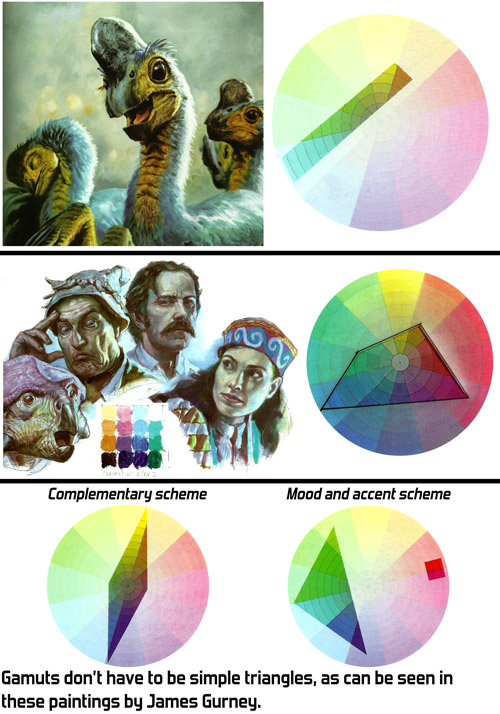
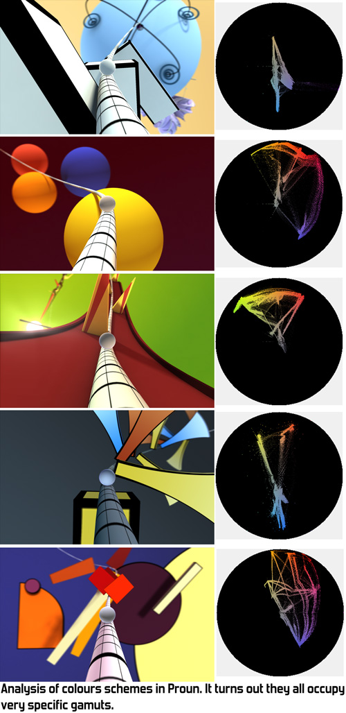
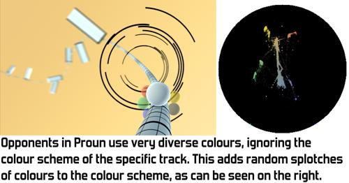
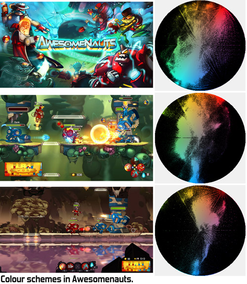
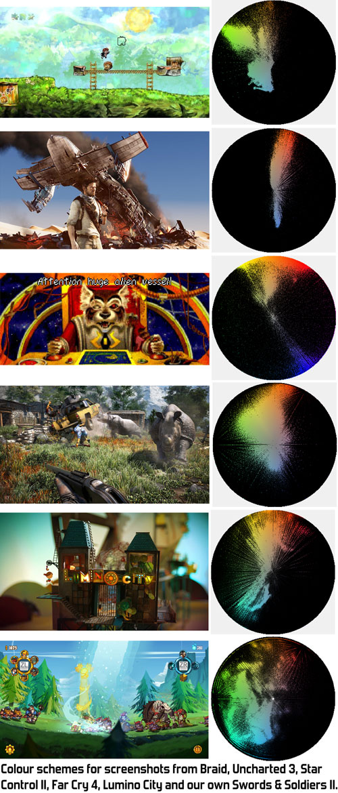

During the Christmas vacation I read the fantastic book [Color and Light: A Guide for the Realist Painter](http://www.amazon.com/Color-Light-Guide-Realist-Painter/dp/0740797719) by James Gurney. It contains a number of really interesting ideas about colour schemes, so I was curious how these relate to existing games. I was especially curious about [Proun](http://www.proun-game.com/): when creating the art for this game I did not know anything practical about colour theory. I just tweaked the colours until they looked good. Apparently this was successful, since reviewers were extremely positive about Proun’s visuals and vibrant colours. How then do the colour schemes in Proun relate to Gurney’s colour theories? To analyse this I have developed a simple little tool that visualises the colour scheme in an image. You can download the tool and source further in this post. So let’s have look: what are Gurney’s ideas and how do they relate to Proun’s art?

The concept I found most interesting in Gurney’s book is *gamut mapping*. To understand this we first need to know the colour wheel. This shows all the colours in a circle. Towards the inside the colours desaturate towards grey. This means that the strongest colours are at the outside. The colour circle is independent of light/dark: each of those colours can still be made lighter or darker.

The idea is that you pick a few colours and only use the colours that can be mixed using those colours. This limits the number of colours that can be used in an artwork. Usually one would pick three colours. This creates a triangle on the colour wheel and we can only use the colours inside the triangle. The area of allowed colours is called the “gamut mask”.

The big revelation to me is that this means that only the three chosen primary colours can be fully saturated. All other colours will be less saturated since they cannot be on the outer rim of the colour wheel, no matter how bright the chosen primary colours are. This limits the colour usage and keeps an artwork from becoming a “fruit salad” as Gurney calls it.

The colour gamut can even be on just one side of the colour wheel, greatly limiting the colour scheme in an artwork. While normally an artist would need to be careful not to use colours too much, when using a limiting gamut it becomes possible to aim for using the brightest colours allowed within the gamut and still achieve a harmonious whole.

I suppose experienced artists might have many other tricks to achieve good colour schemes, and there is probably some really good art that totally doesn’t fit what Gurney explains. Nevertheless the colour gamuts seem like a very sensible and useful tool to me. This made me curious: how do the colour schemes in Proun relate to them?

To be able to exactly analyse the colour schemes of existing art I have hacked together a little C# tool: Joost’s Colour Wheel Visualiser. It simply loads an image (JPG or PNG) and shows which parts of the colour wheel are used in that image. You can download the tool (including source code) here:

[Download Joost’s Colour Wheel Visualiser.zip](http://www.proun-game.com/Oogst3D/BLOG/Joosts%20Colour%20Wheel%20Visualiser.zip) (24kB)*(Note that a recent version of .NET is needed to run it.)*

Now that we have this tool, what do Proun’s colour schemes look like? Let’s have a look.

Surprisingly, it turns out that most of these form quite clear triangles. Apparently while searching for colours that look good together I accidentally used Gurney’s theories quite exactly! I happen to even vary between the schemes he gives as examples: some gamuts are mostly on one side of the colour wheel, while others are quite exact complementary schemes.

One thing I was never really satisfied with in Proun is the colours of the opponents. Those are only seen all together at the very beginning of a race and I always felt like they didn’t look good together. When analysing those colours using my Colour Wheel Visualiser it quickly becomes clear why. As you can see in the image below their colours are random splotches on the colour wheel, unrelated to the other colours in the image.

I think I might have been able to fix this problem by using different colours for the opponents depending on the track, so that I would have been able to match their colours to each track’s colour scheme. [Next time, Gadget](https://www.youtube.com/watch?v=-_2_cJxYYhM)!

I also tried my tool on screenshots from [Awesomenauts](http://www.awesomenauts.com/), which was designed by the[Ronimo](http://www.ronimo-games.com/) art team. In the images below you can see that the colour scheme is all over the place. It really is an explosion of colour, as is fitting for the over-the-top eighties themes of Awesomenauts. Nevertheless you can see that even in the top image the colour scheme ignores large parts of the colour wheel, so even there the colour usage is limited. I think our artists did a great job on the art for Awesomenauts, so this is a good example of how not all good art needs to keep to Gurney’s colour gamuts.

Here are the colour schemes for a number of other games:

