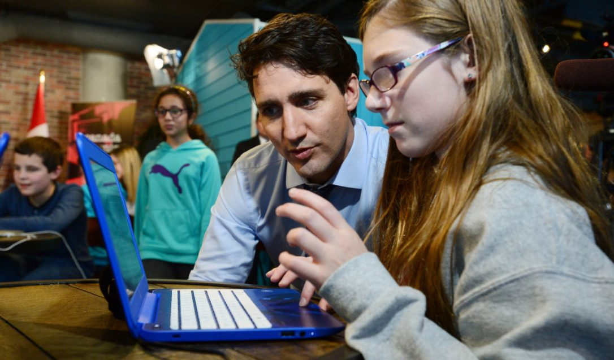

Canadian Prime Minister Justin Trudeau’s [Twitter account](https://twitter.com/JustinTrudeau/status/805896606541369344) lit up today with a message all too familiar to many indie devs: Mr. Trudeau has made a video game, and he’d like everyone to play it.

It was a cute bit of promotion for [Hour of Code](https://hourofcode.com/us), the computer science education event masterminded every year by the Code.org nonprofit. While the Hour of Code websites hosts one-hour tutorials (in 45 languages) for coding all sorts of simple applications, game developers may appreciate that the lion’s share appear to be game projects, like the one Trudeau modified into a sort of hockey-themed *Breakout *variant.

As it always does, the 3rd annual Hour of Code is taking place this week alongside the annual Computer Science Education Week in classrooms and other meeting spaces around the world.

The event has long been supported by partnerships with tech and game companies like [Microsoft and Mojang](http://www.gamasutra.com/view/news/259470/Microsoft_and_Codeorg_teaching_kids_to_code_with_Minecraft.php); any devs interested in taking part (by, say, organizing your own neighborhood game coding event) can find more details on how to do so over on the [Code.org website](https://hourofcode.com/us).
