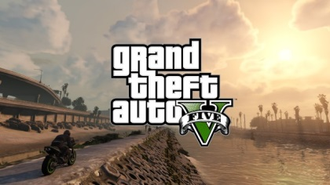

The *[Grand Theft Auto](https://en.wikipedia.org/wiki/Grand_Theft_Auto_%28series%29)* series has come a long way since the first opus came out back in 1997. About 2 years ago, [Rockstar](https://en.wikipedia.org/wiki/Rockstar_Games) released [GTA V](https://en.wikipedia.org/wiki/Grand_Theft_Auto_V). The game was an instant success, selling 11 million units over the first 24 hours and instantly [smashing 7 world records](https://www.polygon.com/2013/10/9/4819272/grand-theft-auto-5-smashes-7-guinness-world-records).

Having played it on PS3 I was quite impressed by the level of polish and the technical quality of the game. Nothing kills immersion more than a loading screen: in GTA V you can play for hours, drive hundreds of kilometers into a huge open-world without a single interruption. Considering the heavy streaming of assets going on and the [specs of the PS3](https://en.wikipedia.org/wiki/PlayStation_3_technical_specifications) (256MB RAM and 256MB of video memory) I’m amazed the game doesn’t crash after 20 minutes, it’s a real technical prowess.

Here I will be talking about the PC version in DirectX 11 mode, which eats up several GBs of memory from both the RAM and the GPU. Even if my observations are PC-specific, I believe many can apply to the PS4 and to a certain extent the PS3.

# Dissecting a Frame

So here is the frame we’ll examine: Michael, in front of his fancy *Rapid GT*, the beautiful city of *Los Santos* in the background.

GTA V uses a [deferred rendering pipeline](https://en.wikipedia.org/wiki/Deferred_shading), working with many HDR buffers. These buffers can’t be displayed correctly as-is on a monitor, so I post-processed them with a simple [Reinhard operator](https://en.wikipedia.org/wiki/Tone_mapping) to bring them back to 8-bit per channel.

### Environment Cubemap

As a first step, the game renders a [cubemap](https://en.wikipedia.org/wiki/Cube_mapping) of the environment. This cubemap is generated in realtime at each frame, its purpose is to help render realistic reflections later. This part is forward-rendered. How is such cubemap rendered? For those not familiar with the technique, this is just like you would do in the real world when taking a panoramic picture: put the camera on a tripod, imagine you’re standing right in the middle of a big cube and shoot at the 6 faces of the cube, one by one, rotating by 90° each time.

This is exactly how the game does: each face is rendered into a 128x128 HDR texture. The first face is rendered like this:

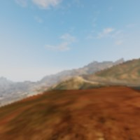

The same process is repeated for the 5 remaining faces, and we finally obtain the cubemap:

[Untitled](22/Untitled%20Database.csv)

Each face is rendered with about 30 draw calls, the meshes are very low-poly only the “scenery” is drawn (terrain, sky, certain buildings), characters and cars are not rendered. This is why in the game your car reflects the environment quite well, but other cars are not reflected, neither are characters.

### Cubemap to Dual-Paraboloid Map

The environment cubemap we obtained is then converted to a [dual-paraboloid map](https://graphicsrunner.blogspot.com/2008/07/dual-paraboloid-reflections.html). The cube is just projected into a different space, the projection looks similar to [sphere-mapping](https://en.wikipedia.org/wiki/Sphere_mapping) but with 2 “hemispheres”.

[Untitled](22/Untitled%20Database%201.csv)

Why such a conversion? I guess it is (as always) about optimization: with a cubemap the fragment shader can potentially access 6 faces of 128x128 texels, here the dual-paraboloid map brings it down to 2 “hemispheres” of 128x128. Even better: since the camera is most of the time on the top of the car, most of the accesses will be done to the top hemisphere. The dual-paraboloid projection preserves the details of the reflection right at the top and the bottom, at the expense of the sides. For GTA it’s fine: the car roofs and the hoods are usually facing up, they mainly need the reflection from the top to look good.

Plus, cubemaps can be problematic around their edges: if each face is mip-mapped independently some seams will be noticeable around the borders, and GPUs of older generation don’t support filtering across faces. A dual-paraboloid map does not suffer from such issues, it can be mip-mapped easily without creating seams.

***Update:*** as pointed-out in the comments below, it seems GTA IV was also relying on dual-paraboloid map, except it was not performed as a post-process from a cubemap: the meshes were distorted directly by a vertex-shader.

### Culling and Level of Detail

This step is processed by a [compute shader](https://www.opengl.org/wiki/Compute_Shader), so I don’t have any illustration for it. Depending on its distance from the camera, an object will be drawn with a lower or higher-poly mesh, or not drawn at all. For example, beyond a certain distance the grass or the flowers are never rendered. So this step calculates for each object if it will be rendered and at which LOD.

This is actually where the pipeline differs between a PS3 (lacking compute shader support) and a PC or a PS4: on the PS3 all these calculations would have to be run on the Cell or the SPUs.

### G-Buffer Generation

The “main” rendering is happening here. All the visible meshes are drawn one-by-one, but instead of calculating the shading immediately, the draw calls simply output some shading-related information into different buffers called *G-Buffer*. GTA V uses [MRT](https://en.wikipedia.org/wiki/Multiple_Render_Targets) so each draw call can output to 5 render targets at once. Later, all these buffers are combined to calculate the final shading of each pixel. Hence the name “deferred” in opposition to “forward” for which each draw call calculates the final shading value of a pixel. For this step, only the opaque objects are drawn, transparent meshes like glass need special treatment in a deferred pipeline and will be treated later.

[Untitled](22/Untitled%20Database%202.csv)

All these render targets are LDR buffers (RGBA, 8 bits per channel) storing different information involved later in the calculation of the final shading value. The buffers are:

- **Diffuse map**: it stores the “intrinsic color” of the mesh. It represents a property of the material, it is in theory not influenced by the lighting. But do you notice the white highlights on the car’s hood? Interestingly GTA V calculates the shading resulting from the sun directional light before outputting to the diffuse map. The alpha channel contains special “blending” information (more on that later).
- **Normal map**: it stores the normal vector for each pixel (R, G, B). The alpha channel is also used although I am not certain in which way: it looks like a binary mask for certain plants close to the camera.
- **Specular map**: it contains information related to specular/reflections:
    - Red: specular intensity
    - Green: glossiness (smoothness)
    - Blue: fresnel intensity (usually constant for all the pixels belonging to the same material)
- **Irradiance map**: the Red channel seems to contain the irradiance each pixel receives from the sun (based on the pixel’s normal and position, and the sun shining direction). I am not 100% sure about the Green channel, but it looks like the irradiance from a second light source. Blue is the emissive property of the pixel (non-zero for neon, light bulbs). Most of the alpha channel is not used except for marking the pixels corresponding to the character’s skin or the vegetation.

So, I was talking before about outputting simultaneously to 5 render targets, but I only presented 4 of them. The last render target is a special *depth-stencil buffer*. Here is what it looks like at the end of this pass:

[Untitled](22/Untitled%20Database%203.csv)

- **Depth map**: it stores the distance of each pixel from the camera. Intuitively you would expect far pixels to be white (depth of 1) and closer pixels to be darker. This is not the case here: GTA V seems to be using a [logarithmic Z-buffer](https://outerra.blogspot.jp/2009/08/logarithmic-z-buffer.html), reversing Z. Why do this? Due to the way they are encoded, floating point numbers have much more precision when closer to 0. Here, reversing Z leads to more precision when storing the depth of very distant objects, hence greatly reduces [Z-fighting](https://en.wikipedia.org/wiki/Z-fighting). Given the long draw distance of the game such trick was necessary. It’s [nothing new](http://www.reedbeta.com/blog/2015/07/03/depth-precision-visualized/) though, *Just Cause 2* for example [was using a similar technique](http://www.humus.name/Articles/Persson_CreatingVastGameWorlds.pdf).
- **Stencil**: it is used to identify the different meshes drawn, assigning the same ID to all the pixels of a certain category of meshes. For example, some stencil values are:
    - `0x89`: the character controlled by the player
    - `0x82`: the vehicle driven by the player
    - `0x01`: NPCs
    - `0x02`: vehicles like cars, bikes…
    - `0x03`: vegetation and foliage
    - `0x07`: sky

All these buffers were generated in about 1900 draw calls.

Notice that the scene is rendered “front-to-back”, this is a way to optimize the rendering thanks to “early Z rejection”: as the scene is drawn, more and more fragments fail the depth test because they are occluded by a closer pixel drawn previously. When it is known a pixel will fail the depth test, the GPU can automatically discard it without even executing the pixel shader. When you have heavy pixel shaders, “back-to-front” rendering (or [Painter’s algorithm](https://en.wikipedia.org/wiki/Painter's_algorithm)) is the worst choice performance-wise, “front-to-back” on the other hand is optimal.

Small digression now, to explain the role of the alpha channel in the diffuse map. Take a look at the screenshot below:

Do you notice some pixels missing? It’s especially visible for the trees, it’s like their sprites lack some texels. I noticed such artifacts a few times on PS3 and I was puzzled at the time. Could it be aliasing when the texture sprite becomes really tiny? I can see now they’re all mip-mapped correctly so it’s not this. This pattern is really specific, like a checkerboard, could it be that… the game skips the rendering of 1 out of 2 pixels? To make sure, I looked into the D3D bytecode. And sure enough, it was here:

Fragment Shader Assembly

[Untitled](22/Untitled%20Database%204.csv)

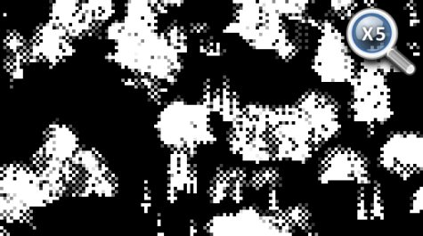

All these instructions are simply equivalent to the test `(x + y) % 2 == 0` which 1 out of 2 pixels always pass. (with *x* and *y* being the pixel’s coordinate) This is just one of several conditions leading to discarding a pixel (another one being having an alpha < 0.75) but it is enough to explain the dithering pattern.

To remember which meshes were drawn in such “dithered mode”, the information is stored in the alpha channel of the diffuse map, which looks like the picture on the right. So why are some models drawn like this? Could it be to save on fillrate or shading calculation? Not really because GPUs don’t have such granularity: pixels are shaded in square of 2x2, not individually. It’s not about performance, it’s about LOD transition: this dithering pattern makes opaque meshes look a bit transparent when they transition between LODs. This technique is actually called [alpha stippling](https://n00body.squarespace.com/journal/2009/9/14/stippled-alpha.html).

### Shadows

The game uses [CSM (cascaded shadow maps)](http://developer.download.nvidia.com/SDK/10.5/opengl/src/cascaded_shadow_maps/doc/cascaded_shadow_maps.pdf): 4 shadow maps are generated into a 1024x4096 texture. Each shadow map is created for a different camera frustum, the frustum getting bigger and encompassing a higher portion of the scene as the iteration goes. This ensures the shadows near the player are stored with higher resolutions, while shadows further away have fewer details. Here is an overview of the depth information of the 4 maps:

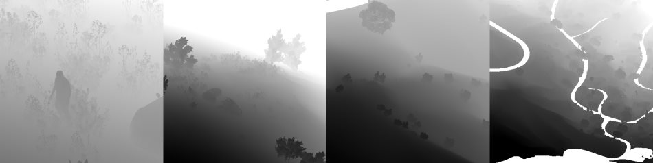

This step can potentially have a high cost since the scene needs to be re-rendered 4 times, but frustum-culling avoids rendering unnecessary polygons. Here the CSM generation is achieved in about 1000 draw calls.

From this depth information, we can calculate the shadow cast on each pixel. The engine stores the shadow information in a render target: shadows cast by the sun directional light are in the Red channel, the ones cast by the clouds in the atmosphere are in both the Red and the Green channels.

The shadow maps are sampled with a dithering pattern (if you look closely at the texture below, the red channel displays some checkerboard-like artifacts), this is to make the shadow borders smoother. These artifacts are then corrected: sun shadows and cloud shadows are combined into a single buffer, some depth-aware blur is performed and the result is stored into the alpha channel of the specular map.

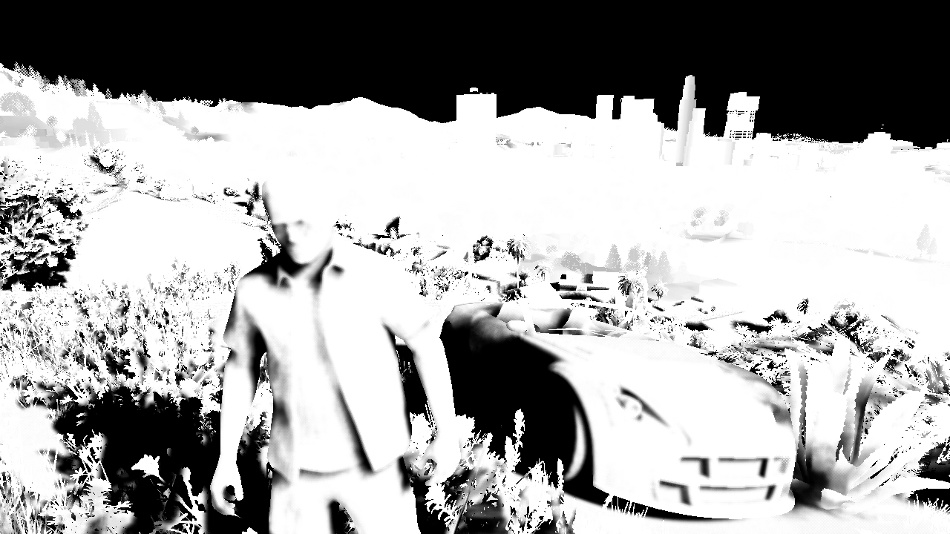

A quick note about the blur operation: it is quite expensive because it needs to do many taps from multiple textures. So to alleviate the load, just before performing the blur, an “early out” texture is created: the shadow buffer is downscaled to 1/8th, and a light-weight blur is performed by a pixel shader making 4 calls to `[Gather()](https://msdn.microsoft.com/library/windows/desktop/bb944003%28v=vs.85%29.aspx)`. This can give a rough estimate of which pixels are fully lit. Then when the full depth-aware blur is performed, the first step consists in reading this “early out” buffer: if the current pixel appears to be fully lit the pixel shader immediately outputs 1 and skips all the heavy blur computation.

### Planar Reflection Map

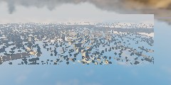

I won’t go too much into details since reflections are explained more in details in *[Part 2](http://www.adriancourreges.com/blog/2015/11/02/gta-v-graphics-study-part-2/)* and the effect is barely visible in this scene, but this step generates a reflection map for the ocean surface.

Basically the scene is drawn again (in 650 draw calls) into a tiny 240x120 texture, but “upside-down”, to appear like a reflection on a water surface.

### Screen Space Ambient Occlusion

[Untitled](22/Untitled%20Database%205.csv)

### G-Buffer Combination

Time to finally combine all these buffers which have been generated! A pixel shader fetches the data from the different buffers and computes the final shading value of the pixel in HDR. In the case of a night scene, lights and their irradiance would also now be added one by one on the top of the scene.

[Untitled](22/Untitled%20Database%206.csv)

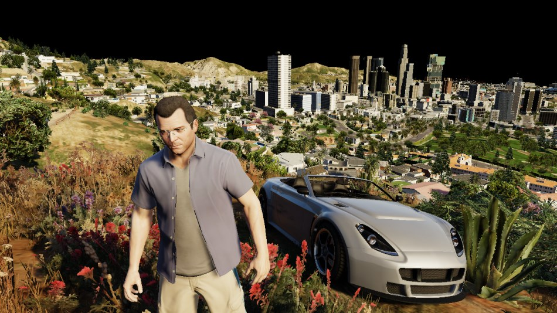

It’s starting to take shape nicely, although we’re still missing the ocean, the sky, transparent objects… But first things first: Michael’s appearance needs to be enhanced.

### Subsurface Scattering

The shading of Michael’s skin is a bit off: there are very dark areas on his face, like if his body was made of thick plastic instead of flesh.

This is why a pass of [SSS](https://en.wikipedia.org/wiki/Subsurface_scattering) is performed, simulating the transport of light within the skin. Look at his ears or his lips: after the SSS pass the light is now bleeding through them, giving a red tint which is exactly what you would expect to happen in the real world.

How was the SSS applied to Michael only? First only his silhouette is extracted. This is possible thanks to the stencil buffer generated before: all of Michael’s pixels have a value of `0x89`. So we can get Michael’s pixels, great, but we want to apply the SSS only to the skin, not to the clothes. Actually, when all the G-Buffers were combined, in addition to the shading data stored in the RGB, some data was being written to the alpha channel too. More precisely, the irradiance map and the specular map alpha channels were used to create a binary mask: the pixels belonging to Michael’s skins and to some plants are set to 1 in the alpha channel. Other pixels like the clothes have an alpha of 0. So the SSS can be applied by providing as input simply the combined G-Buffer target and the depth-stencil buffer.

Now, you might think this amounts to a lot of computation for just a subtle, local improvement. And you would be right, but don’t forget that when playing the game, as humans we instinctively tend to look at the character’s face a lot – any rendering improvement made to the face can be a big win for the feeling of immersion. In the game SSS is applied to both your character and the NPCs.

### Water

There is not much water in this scene but still, we have the ocean in the back, some swimming pools here and there. The water rendering in GTA V handles both [reflection](https://en.wikipedia.org/wiki/Reflection_%28physics%29) and [refraction](https://en.wikipedia.org/wiki/Refraction).

The logarithmic Z-buffer created previously is used to generate a second version: linear this time, at half the resolution. The ocean and pools are drawn one by one, in MRT mode, outputting to several targets at once:

[Untitled](22/Untitled%20Database%207.csv)

- **Water Diffuse map**: it is the intrinsic color of the water.
- **Water Opacity map**: the red channel seems to store some opacity property of the water (for example ocean is always 0.102, pools are always 0.129). The green channel stores how deep a pixel is from the water surface (deep pixels have a more opaque water with a strong contribution from the diffuse map, whereas water for shallow pixels is almost transparent). Note that all the pools are rendered unconditionally, even if they end up hidden behind another mesh in the scene, they all appear in the red channel. For the green channel however, only the pixels really visible are calculated, the only “water” pixels that make it into the final image.

We can now combine the previous buffers we created and generate a refraction map:

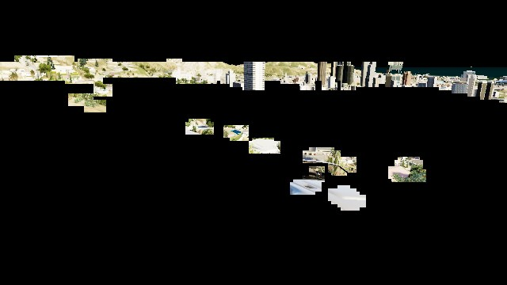

In this refraction map, the pools are filled with water (the deeper the water the bluer), [caustics](https://en.wikipedia.org/wiki/Caustic_%28optics%29) are also added.

We can now proceed to the final rendering of the water: once again all the meshes of the ocean, the pool surfaces are drawn one by one, but this time combining the reflection and the refraction together, with some bump maps to perturb the surface normals.

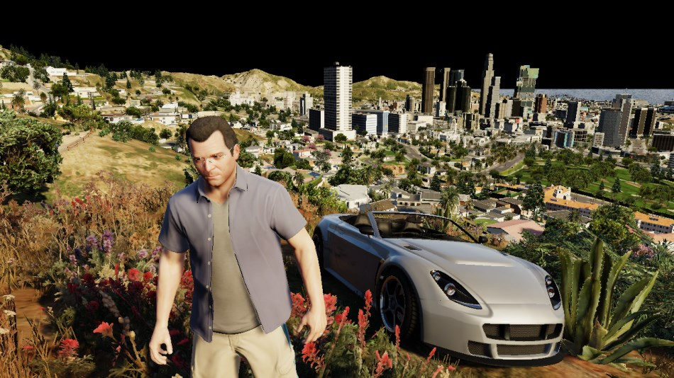

### Atmosphere

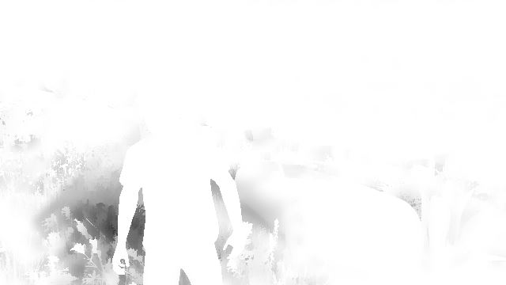

A [light-shaft](https://docs.unrealengine.com/latest/INT/Engine/Rendering/LightingAndShadows/LightShafts/index.html) map – also called “volumetric shadows” – is created: its role is to darken the atmosphere/fog which is not directly lit by the sun.

The map is generated at half the resolution, by ray-marching each pixel and evaluating against the sun shadow map. After a first noisy result is obtained, the buffer is blurred.

The next step consists in adding a fog effect to our scene: it conveniently hides the lack of details of the low-poly buildings in the distance. This pass reads from the light-shaft map (which has little influence in this shot) and the depth-buffer to output the fog information.

Then the sky is rendered, followed by the clouds.

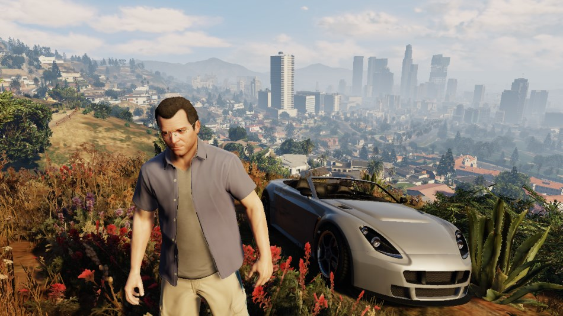

The sky is actually rendered in a single draw call: the mesh used is a huge dome covering the entire scene. (see on the right) This step uses as input some textures similar to [Perlin noise](https://en.wikipedia.org/wiki/Perlin_noise).

The clouds are rendered in a similar way: a large mesh, with a shape of ring this time, is rendered in the horizon. One normal map and one density map are used to render the clouds: these are big 2048x512 textures, which are also seamless (they loop on their left and right sides).

[Untitled](22/Untitled%20Database%208.csv)

### Transparent Objects

This step renders all the transparent objects of the scene: the glasses, the windshield, the dust particles flying around…

All this is performed in only 11 draw-calls, instancing being heavily used for particles.

### Dithering Smoothing

Remember our [small digression](http://www.adriancourreges.com/blog/2015/11/02/gta-v-graphics-study/) previously about some trees being dithered in the diffuse map? It’s time to fix these artifacts: a post-process effect is performed with a pixel shader, reading the original color buffer and the alpha channel of the diffuse map, to know which pixels have been dithered. For each pixel, up to 2 neighbor pixels can be sampled to determine the final “smoothed” color value.

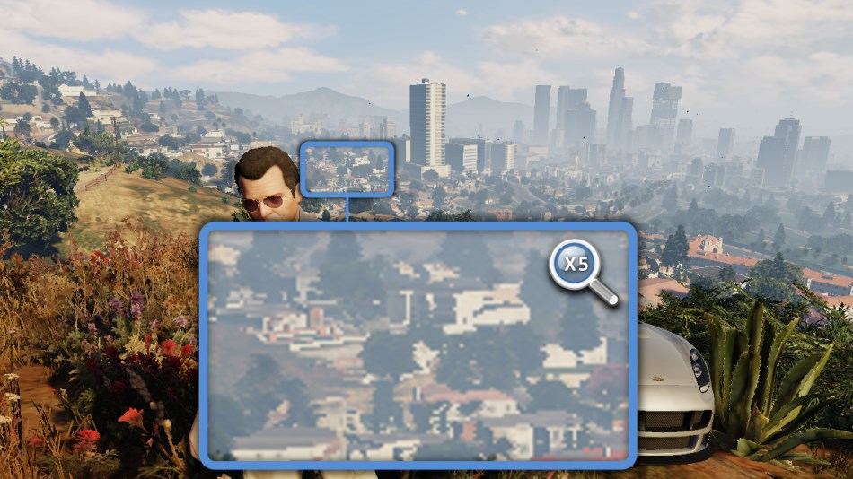

It’s a nice trick because with just a single pass the image is “healed”: the cost is constant, it’s independent from the amount of geometry in the scene. Note though that this filter is not perfect: both on PS3 and PC I noticed some checkerboard pattern on the screen that the filter didn’t catch in some situations.

### Tone Mapping and Bloom

Our render image up until now has been stored in HDR format: each of the RGB channels is stored as a 16-bit float. This allows to have huge variations in the light intensity. But monitors cannot display such a high range of value, they only output RGB colors with 8-bit per channel.[Tone Mapping](https://en.wikipedia.org/wiki/Tone_mapping) consists in converting these color values from an HDR to a LDR space. There are [several functions which exist to map a range to another](https://mynameismjp.wordpress.com/2010/04/30/a-closer-look-at-tone-mapping/). A classic one which is widely used is *[Reinhard](http://www.cmap.polytechnique.fr/~peyre/cours/x2005signal/hdr_photographic.pdf)* and it’s actually the one I used when generating all the previous screenshots, it gives results close to the final render of the game.

But does GTA V really use *Reinhard*? Time to reverse some shader bytecode again:

Fragment Shader Assembly - Tone Mapping

[Untitled](22/Untitled%20Database%209.csv)

Well well well… what do we have here?`(x(Ax+BC)+DE) / (x(Ax+B)+DF) - (E/F)` is the typical equation of a [tonemapping operator John Hable used](http://filmicgames.com/archives/75) in 2009 at Naughty Dog. It is a filmic tonemapping technique [developed by Haarm-Pieter Duiker](http://duikerresearch.com/2015/09/filmic-tonemapping-ea-2006/) in 2006 while at EA. It turns out GTA V doesn’t use *Reinhard* but the *Uncharted 2* operator which doesn’t desaturate the black areas as much.

The process to convert to LDR is as follows:

- the HDR buffer is downscaled to ¼th of the resolution.
- a compute shader is used to calculate the average luminance of the buffer, outputting the result to a 1x1 texture.
- the new exposure is calculated, it controls how bright/dark the scene appears.
- a bright-pass filter is used to extract only the pixels having a luminance higher than a certain threshold (determined from the exposure). In this scene only a few pixels survive the filter: some spots of the car which have a strong reflected luminance.
- the brightness buffer is repeatedly down-sized and blurred up to 1/16th of the original size, then upscaled again several times until it reaches back half its original size.
- The bloom is added to the original HDR pixels and then the *Uncharted 2* tone-map operator converts the color to LDR, applying a gamma correction at the same time, leaving the linear space for the sRGB space.

The final result depends a lot on the exposure. Here are some examples illustrating the influence of this parameter:

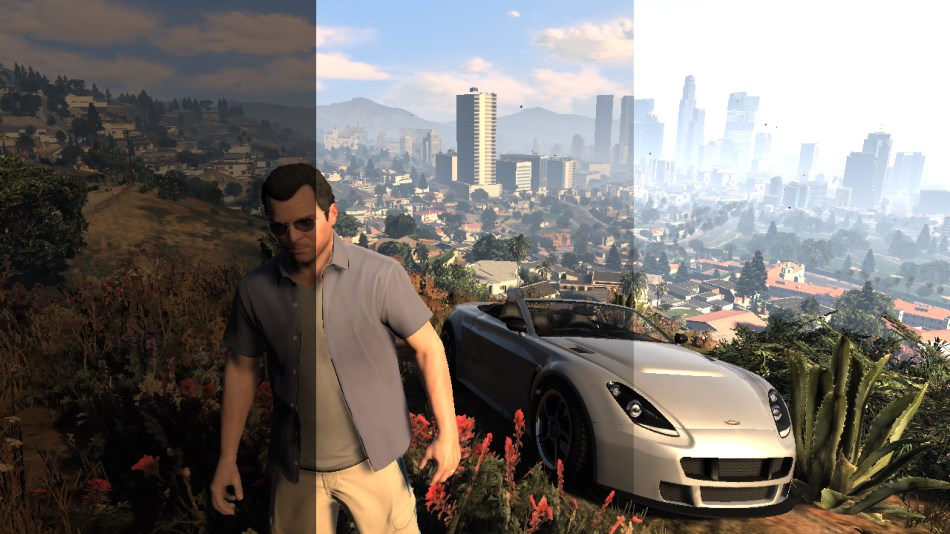

The exposure actually slowly evolves frame after frame, there are never abrupt changes. This is meant to simulate the human eye behavior: have you noticed that after driving in a dark tunnel and suddenly exiting under the sunshine all the environment looks too bright during a few frames? It then gradually goes back from “blinding” to “normal” while the exposure is adjusting to a new value. It seems GTA V even goes as far as giving “Dark → Bright” transitions a faster exposure adaptation than “Bright → Dark” ones, just like a human eye would behave.

### Anti-Aliasing and Lens Distortion

If the anti-aliased method used is [FXAA](https://en.wikipedia.org/wiki/Fast_approximate_anti-aliasing), it is now performed to smooth-out the jagged edges of the meshes. Then, to simulate a real-world camera, a [lens-distortion](https://en.wikipedia.org/wiki/Distortion_%28optics%29) is performed on the image by using a small pixel shader. It does not only distorts the image, it also introduces small [chromatic aberrations](https://en.wikipedia.org/wiki/Chromatic_aberration) on the edges of the frame, by slightly distorting more the red channel compared to the green and blue ones.

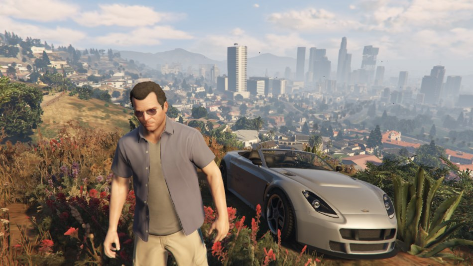

### UI

Last touch: the UI, which here simply consists in the mini-map at the bottom-left corner of the screen. The map is actually divided into several square tiles, the engine draws only the set of tiles which potentially appear on the screen. Each tile is drawn through one draw-call. I colorized the tiles so you can see the structure better:

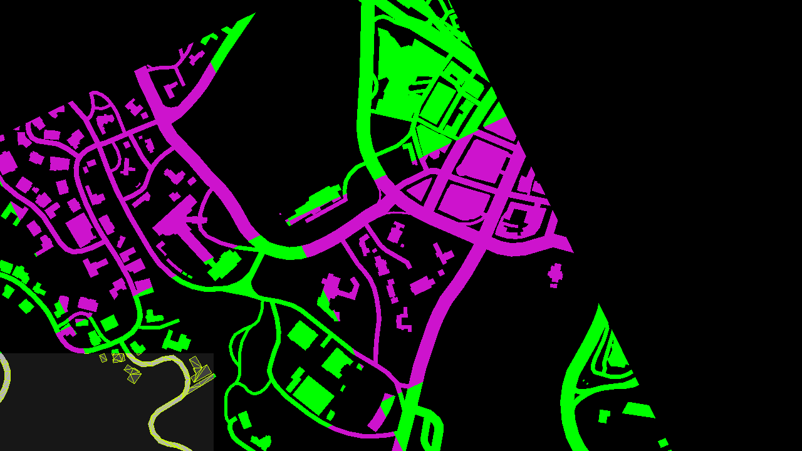

The scissor test is enabled to only allow the rendering in the bottom-left corner and discard everything outside of it. All the roads are actually vectorized (see the wireframe in the screenshot above), they are rendered as meshes and can look great at pretty much any level of zoom.

The mini-map is then drawn into the main image buffer, and a few small icons and widgets are added on the top of it.

Well, it took a while but here you have it: the final frame in all its glory! All in all there were 4155 draw calls, 1113 textures involved and 88 render targets.

Still want to know more? Head over to **[Part 2 – LOD and Reflections](http://www.adriancourreges.com/blog/2015/11/02/gta-v-graphics-study-part-2/)**.
