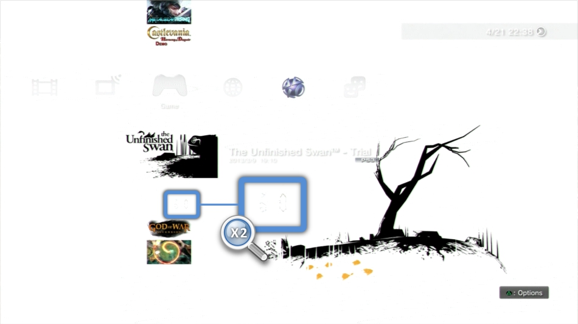
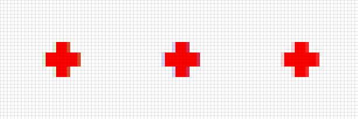
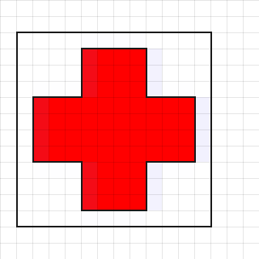
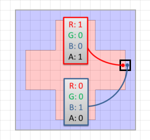
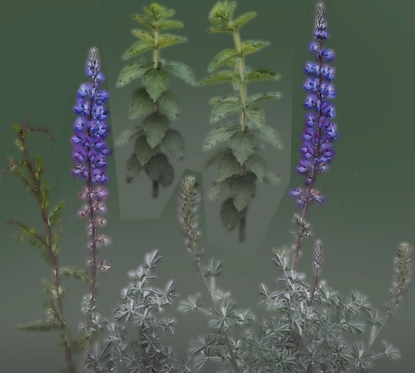

If you use sprites with transparency in your game — and you most likely do for the UI at least — you’ll probably want to pay attention to the fully transparent pixels of your textures (or should I say “texels”).

Even with an alpha of 0, a pixel still has some RGB color value associated with it. That color shouldn’t matter, right? After all if the pixel is completely transparent, who cares about its color…

Well this color does actually matter, getting it wrong leads to artifacts which are present in many games out there. Most of the time the corruption is very subtle and you won’t notice it but in some cases it’s really standing out.

# Corruption Example

Time for a real-world example! Here is the *[XMB](https://en.wikipedia.org/wiki/XrossMediaBar)* of my PS3 (home menu), browsing some game demos installed. At first *[Limbo](https://en.wikipedia.org/wiki/Limbo_(video_game)* is selected, I just press “Up” to move the focus to *[The Unfinished Swan](https://en.wikipedia.org/wiki/The_Unfinished_Swan)* (both great games by the way).

Do you see what’s happening in the *Limbo* logo area?*The Unfinished Swan* white background fades-in and we end up with the *Limbo* logo — pure white — drawn on the top of a background which is also pure white. Everything should be completely white in that area, so why do we have these weird gray pixels?

The corruption most likely comes from the *Limbo* texture using wrong RGB colors for its fully transparent pixels.

# Texture Filtering

The artifacts are actually due to the way the GPU filters a texture when it renders a sprite on the screen. Let’s see how this all works with a simple example.

Here is a tiny 12x12 pixel texture of a red cross:

On the left is a zoomed view, the checkerboard pattern is just here to emphasize the completely transparent area with an alpha of 0. You could use this sprite as an icon to display health points in your UI or as a texture for some in-game med-kit model… ([No wait! You don’t want to do this actually!](https://kotaku.com/video-games-arent-allowed-to-use-the-red-cross-symbol-1791265328))

Let’s make three versions of this sprite, by changing only the color value of the pixels with an alpha of 0.

[Untitled](24/Untitled%20Database.csv)

(You can download the image files and do some color picking to confirm the RGB value of the transparent pixels)

These 3 sprites look exactly the same on your screen, right? It makes sense: we only modified the color value of the transparent pixels, which end up being invisible anyway. But let’s see what happens when these sprites are in motion. Here is a zoomed view to better see the screen pixels:

Well that’s quite some corruption we have here! Some brown tint for the first sprite, purple tint for the second one. The 3rd one… is correct, it’s how it’s supposed to look.

Let’s focus on the blue version:

As you can see the issue happens when the texture is not perfectly pixel-aligned with the screen pixels. This can be explained by the [bilinear filtering](https://en.wikipedia.org/wiki/Bilinear_filtering) the GPU performs when rendering a sprite on the screen: when sampling a texture, the GPU averages the color values of the closest neighbors of the coordinates requested, both in the vertical and horizontal direction.

So if we consider the case where the sprite is misaligned by exactly half a pixel:

Each pixel of the screen will sample the sprite texture right in the middle between 2 texels. This is what happens with the pixel you see on the left: it fetches the sprite texture in the middle between a solid red texel and a transparent blue texel. The averaged color is:

0.5⋅1001+0.5⋅0010=0.500.50.5

Which is some translucent purple looking like this: █

This color returned by the texture sampler will now be alpha-blended on the top of the render target (solid white). The blending equation is of the form:

αsprite⋅RGBsprite+(1−αsprite)⋅RGBBackground =0.5⋅0.500.5+(1−0.5)⋅111 =0.750.50.75

So the final color on the monitor pixel is this: █

Which is not what we wanted. The correct result — which is produced when the transparent pixels are red — would be as follows:

1000.5 is the bilinear interpolated value, which is then blended to produce 10.50.5 displayed on the screen as: █

So what can we do to avoid these ugly artifacts?

# How to Prevent This Issue

### As an Artist: Make it Bleed!

If you’re in charge of producing the asset, be defensive and don’t trust the programmers or the engine down the line. It’s very possible that at some point in the pipeline the colors of transparent pixels will bleed onto their surroundings. We just saw it happen with texture bilinear filtering, it can also happen during mip-map generation…

You can fight this color-bleeding by doing…**more color-bleeding!** :)

By this I mean that when you’re about to export your asset on the disk you first make all your opaque pixels bleed into the RGB values of the neighbor transparent pixels (this is also called *flood-filling* or *edge-padding*). This way when the transparent pixels later at runtime bleed onto their opaque neighbors, at least they’ll bleed the correct color.

On the right is a real-world example: a foliage sprite atlas extracted from *[GTA V](https://en.wikipedia.org/wiki/Grand_Theft_Auto_V)*, with and without its alpha channel.

Notice the border around the non-zero-alpha pixels: the transparent pixels are borrowing the colors from their nearest visible neighbors. It’s no coincidence Rockstar went through the hassle of doing this.

There are tools to help with this process: Photoshop has a *[Solidify* plugin](http://www.flamingpear.com/freebies.html), Gimp has [a plugin](http://gimpchat.com/viewtopic.php?t=3153) too… And be careful to export the RGB values of transparent pixels when you save to PNG for example, many programs will by default discard transparent pixel RGB data and replace it with a solid color (white or black) during the export to help with the compression. If you’re using Photoshop you’ll need [this other plugin](https://github.com/fnordware/SuperPNG) to preserve color values during PNG export.

John Carmack also [advocates this approach](https://www.facebook.com/permalink.php?story_fbid=1818885715012604&id=100006735798590):

> Make sure that the colors stay consistent all the way to the edge, even where the alpha channel is 0. It is very common to see blended graphics with a dark fringe around them because the texture went to 0 0 0 0 right at the outline, rather than just cutting it out in the alpha channel.

### As a Programmer: Use Premultiplied Alpha!

You’re a programmer, you already know better than blindly trusting the assets provided by the artists. Fortunately as a programmer you have more options to fight the problem.

You could have some tool to automate the color bleeding we talked about previously, it would be triggered at the asset import time. But you have a much better and more reliable solution: premultiplied alpha.

I won’t go much into depth about it because other people already wrote fine explanations like [here](https://blogs.msdn.microsoft.com/shawnhar/2009/11/06/premultiplied-alpha/) and [here](https://blogs.msdn.microsoft.com/shawnhar/2009/11/07/premultiplied-alpha-and-image-composition/). Also highly recommended: Tom Forsyth’s posts [#1](https://tomforsyth1000.github.io/blog.wiki.html#%5B%5BPremultiplied%20alpha%5D%5D) and [#2](https://tomforsyth1000.github.io/blog.wiki.html#%5B%5BPremultiplied%20alpha%20part%202%5D%5D) on the topic.

The idea is very simple: instead of storing a texture as RGBα store it as α⋅Rα⋅Gα⋅Bα .

The RGB components have just been multiplied by the alpha value of the pixel. The original color can still be retrieved easily: dividing by alpha will reverse the transformation.

So a sprite would be turned into this:

[Untitled](24/Untitled%20Database%201.csv)

It’s also necessary to modify the blending equation, since our texture now contains the first multiplication result, no need to multiply by alpha again:

In OpenGL terms this would translate by performing the following change for the blend function:

`glBlendFunc(GL_SRC_ALPHA, GL_ONE_MINUS_SRC_ALPHA)` ⇒ `glBlendFunc(GL_ONE, GL_ONE_MINUS_SRC_ALPHA)`

Going back to our sprite of a red cross shifted by half-a-pixel, if we were in premultiplied mode: the bilinear interpolator would average between 1001 and 0000 to return 0.5000.5= █ then blended to finally obtain 10.50.5= █ .

Which is correct and pretty much solves all our problems! The final result is exactly the same as what you would expect from “traditional” blending — except we got rid of all the artifacts. You’ll notice that in a premultiplied alpha workflow, a fully transparent pixel always has a pure black RGB value so we don’t have to care about what the transparent areas of a sprite actually contain. Premultiplied alpha also avoids some headache when generating mip-map chains or when compositing several translucent sprites on the top of each other.

# Wrapping Up

So to go back to the original topic: was the *Limbo* logo issue really due to garbage in the RGB of transparent pixels? Only one way to know for sure, so I extracted the PNG file from the demo package `/PS3_GAME/ICON0.PNG`. The image looks perfectly fine at first glance, but let’s remove the alpha channel to visualize the full RGB values:

Well here you have it: instead of some solid white everywhere the holes of ‘B’ and ‘O’ are filled with some wrong RGB, which then bleed and cause the glitch we saw previously.

The issue with these artifacts is that they’re hard to detect, I hadn’t noticed anything wrong with the *Limbo* logo up until it was rendered on the top of a white background. Not everybody knows about the problem to begin with so raising awareness on the topic cannot hurt.

If you’re an artist, you’re the first line of defense, pay attention to what color you put inside the transparent pixels. If you’re a programmer, think about premultiplied alpha.

***Update:*** for a more in-depth analysis of this problem, I highly recommend Eric Haines’ post: [“GPUs prefer premultiplication”](http://www.realtimerendering.com/blog/gpus-prefer-premultiplication/). Further discussion on this topic: [Hacker News](https://news.ycombinator.com/item?id=14310652), [Reddit](https://www.reddit.com/r/gamedev/comments/6aev9i/adrian_courr%C3%A8ges_beware_of_transparent_pixels/).
