[DOOM](https://en.wikipedia.org/wiki/Doom_(1993_video_game)) pioneered fundamental changes in game design and mechanics back in 1993, it was a world-wide phenomenon which propelled to fame iconic figures like [John Carmack](https://en.wikipedia.org/wiki/John_Carmack) and [John Romero](https://en.wikipedia.org/wiki/John_Romero)…

23 years later, [id Software](https://en.wikipedia.org/wiki/Id_Software) now belongs to [Zenimax](https://en.wikipedia.org/wiki/ZeniMax_Media), all the original founders are gone but it didn’t prevent the team at id from showing all its talent by delivering a great game.

The new [DOOM](https://en.wikipedia.org/wiki/Doom_(2016_video_game)) is a perfect addition to the franchise, using the new [id Tech 6 engine](https://en.wikipedia.org/wiki/Id_Tech_6) where ex-Crytek [Tiago Sousa](https://twitter.com/idSoftwareTiago) now assumes the role of lead renderer programmer after John Carmack’s departure. Historically id Software is known for open-sourcing their engines after a few years, which often leads to [nice remakes](https://www.chocolate-doom.org/wiki/index.php/Chocolate_Doom) and [breakdowns](http://fabiensanglard.net/doomIphone/doomClassicRenderer.php). Whether this will stand true with id Tech 6 remains to be seen but we don’t necessarily need the source code to appreciate the nice graphics techniques implemented in the engine.

We’ll examine the scene below where the player attacks a *[Gore Nest](http://doom.wikia.com/wiki/Gore_nest)* defended by some *[Possessed](http://doom.wikia.com/wiki/The_Possessed_(Enemy))* enemies, right after obtaining the *Praetor Suit* at the beginning of the game.

Unlike most Windows games released these days, DOOM doesn’t use [Direct3D](https://en.wikipedia.org/wiki/Direct3D) but offers an [OpenGL](https://en.wikipedia.org/wiki/OpenGL) and [Vulkan](https://en.wikipedia.org/wiki/Vulkan_(API)) backend. Vulkan being the new hot thing and [Baldur Karlsson](https://twitter.com/baldurk) having recently added support for it in [RenderDoc](https://github.com/baldurk/renderdoc), it was hard resisting picking into DOOM internals. The following observations are based on the game running with Vulkan on a [GTX 980](https://en.wikipedia.org/wiki/GeForce_900_series) with all the settings on *Ultra*, some are guesses others are taken from the [Siggraph presentation by Tiago Sousa and Jean Geffroy](http://advances.realtimerendering.com/s2016/Siggraph2016_idTech6.pdf).

### Mega-Texture Update

First step is the [Mega-Texture](https://en.wikipedia.org/wiki/MegaTexture) update, a technique already present in [id Tech 5](https://en.wikipedia.org/wiki/Id_Tech_5) used in [RAGE](https://en.wikipedia.org/wiki/Rage_(video_game)) and now also used in DOOM. To give a very basic explanation, the idea is that a few huge textures (16k x 8k in DOOM) are allocated on the GPU memory, each of these being a collection of 128x128 tiles.

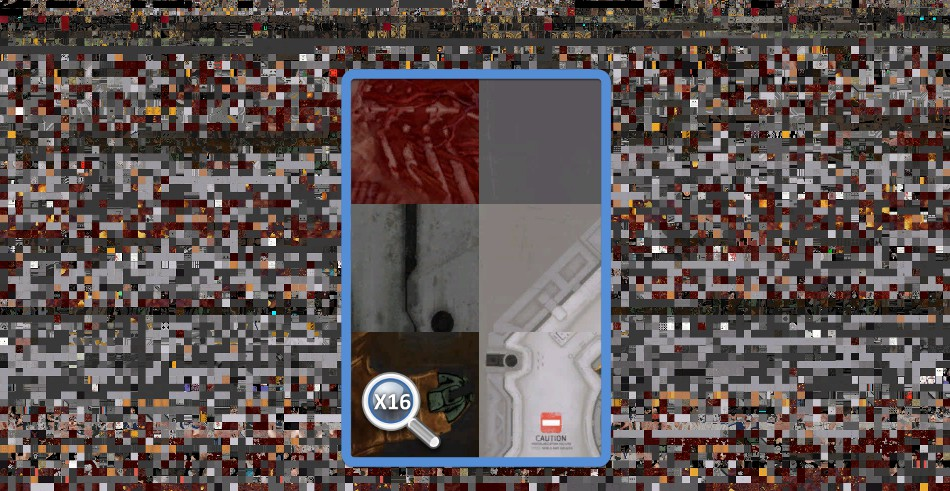

All these tiles are supposed to represent the ideal set of actual textures at the good mipmap level which will be needed by the pixel shaders later to render the particular scene you’re looking at. When the pixel shader reads from a “virtual texture” it simply ends up reading from some of these 128x128 physical tiles. Of course depending on where the player is looking at, this set is going to change: new models will appear on screen, referencing other virtual textures, new tiles must be streamed in, old ones streamed out… So at the beginning of a frame, DOOM updates a few tiles through `vkCmdCopyBufferToImage` to bring some actual texture data into the GPU memory.

*More information about Mega-Textures [here](http://www.mrelusive.com/publications/papers/Software-Virtual-Textures.pdf) and [here](http://s09.idav.ucdavis.edu/talks/05-JP_id_Tech_5_Challenges.pdf).*

### Shadow Map Atlas

For each light casting a shadow, a unique [depth map](https://en.wikipedia.org/wiki/Depth_map) is generated and saved into one tile of a giant 8k x 8k [texture atlas](https://en.wikipedia.org/wiki/Texture_atlas). However not every single depth map is calculated at every frame: DOOM heavily re-uses the result of the previous frame and regenerates only the depth maps which need to be updated.

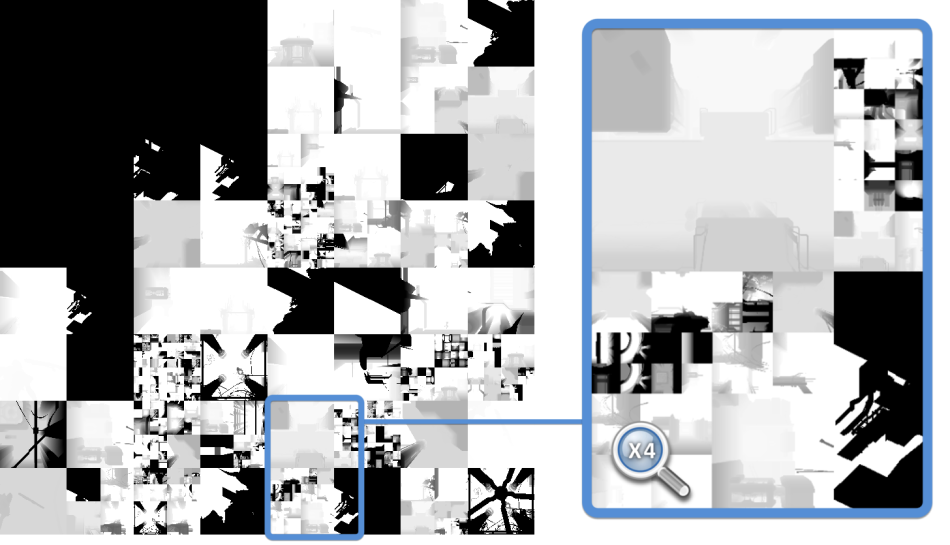

When a light is static and casts shadows only on static objects it makes sense to simply keep its depth map as-is instead of doing unnecessary re-calculation. If some enemy is moving under the light though, the depth map must be generated again. Depth map sizes can vary depending on the light distance from the camera, also re-generated depth maps don’t necessarily stay inside the same tile within the atlas. DOOM has specific optimizations like caching the static portion of a depth map, computing then only the dynamic meshes projection and compositing the results.

### Depth Pre-Pass

All the opaque meshes are now rendered, outputting just their depth information into a depth map. First the player’s weapon, then static geometry and finally dynamic geometry.

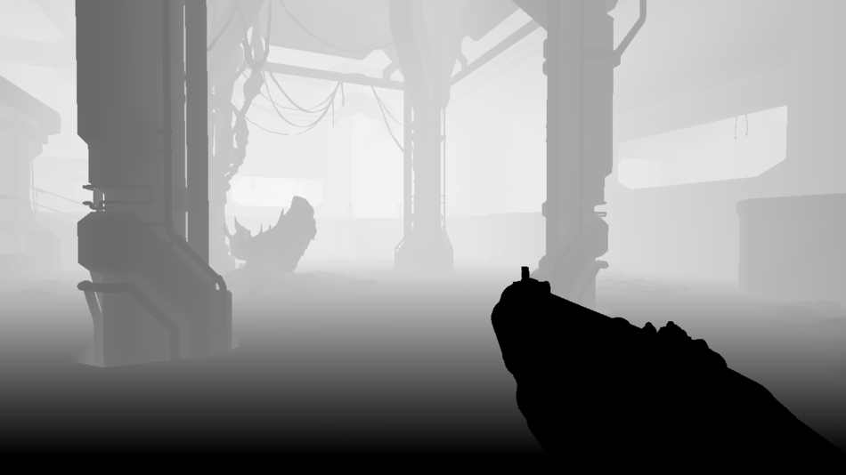

But actually the depth was not the only information outputted during the depth pre-pass. While dynamic objects (the *Possessed*, cables, the player’s weapon) were rendered to the depth map, their velocity per-pixel was also calculated and written to another buffer to create a velocity map. This is done by computing in the vertex shader the position difference of each vertex between the previous and the current frame.

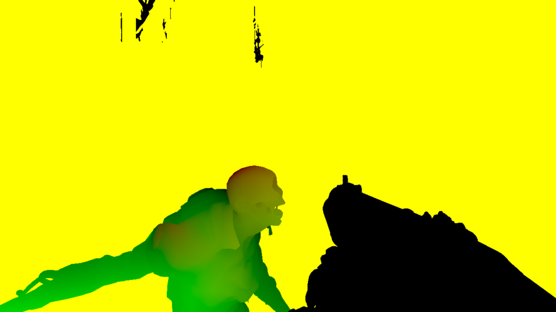

We only need 2 channels to store the velocity: red is the speed along the horizontal axis and green along the vertical axis. The *Possessed* is quickly moving towards the player (green) while the weapon is barely moving (black). What about the yellow area (red and green both equal to 1)? It’s actually the original default color of the buffer, that no dynamic mesh ever touched: it’s all the *“static mesh area”*. Why does DOOM skip the velocity calculation for static meshes? Because a static pixel velocity can simply be inferred from its depth and the player’s camera new state since last frame, no need to calculate it on a per-mesh basis. The velocity map will be useful later to apply some [motion blur](https://en.wikipedia.org/wiki/Motion_blur).

### Occlusion Queries

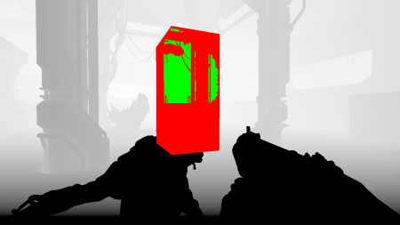

We want to send as little geometry to render to the GPU as possible so the best way to achieve this is to cull all the meshes which are not directly visible by the player. Most of the occlusion culling in DOOM is done through the [Umbra middleware](http://umbra3d.com/knee-deep-in-the-dead/) but there are still some *GPU occlusion queries* performed by the engine to further trim down the visibility set.

So what’s the idea behind GPU occlusion queries? First step is to group several meshes of the world into a virtual box encompassing them all, then ask the GPU to render this box against the current depth buffer. If none of the rasterized pixels pass the depth test it means the box is completely occluded and all the world objects inside that box can be safely omitted when rendering. Well, the thing is these occlusion query results aren’t available right away, you don’t want to stall the GPU pipeline by blocking on a query. Typically, reading results is deferred to the following frames, so it’s necessary to have an algorithm a bit conservative to avoid objects popping.

### Clustered-Forward-Rendering of Opaque Objects

All the opaque geometry and the decals are now rendered. The lighting information is stored into a float HDR buffer:

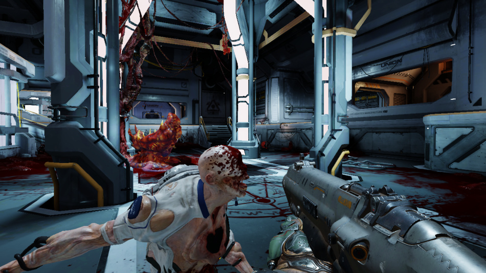

The depth test function is set to `EQUAL` to avoid any useless overdraw computation, thanks to the previous depth pre-pass we know exactly which depth value each pixel is supposed to have. The decals are also applied directly when meshes are rendered, they’re stored in a texture atlas.

It’s already looking good, but we’re still missing some transparent materials like glass, or particles and there’s no environment reflection at all yet.

A few words about this pass: it uses a clustered forward renderer which is inspired by [Emil Person’s](http://www.humus.name/Articles/PracticalClusteredShading.pdf) and [Ola Olsson’s](http://www.cse.chalmers.se/~uffe/clustered_shading_preprint.pdf) work. Historically one of the weaknesses of forward rendering was its inability to handle a large number of lights, something much easier to handle in deferred. So how does a clustered renderer work? Well first you divide your viewport into tiles: DOOM creates a 16 x 8 subdivision. Some renderer would stop here and compute a list of lights per tile which helps bring down the amount of lighting computation but still suffers from some edge cases.

Clustered rendering takes the concept further, from 2D to 3D: instead of stopping at a 2D viewport subdivision, it actually performs a 3D subdivision of the entire camera frustum by creating slices along the Z axis.

Each “block” is called a “cluster”, you could also call them “frustum-shaped” [voxels](https://en.wikipedia.org/wiki/Voxel) or “froxels”. On the right is some visualization of a simple 4 x 2 viewport subdivision, with 5 depth slices dividing the frustum into 40 clusters.

In DOOM the camera frustum is divided into 3072 clusters (a 16 x 8 x 24 subdivision), the depth slices being positioned in a logarithmic way along the Z axis.

With a clustered renderer, a typical flow would be:

- First the CPU calculates the list of items which influence lighting inside each cluster: lights, decals and cubemaps… To do so all of these items are “voxelized” so their area of influence can be tested for intersection with clusters. The data is stored as indexed-lists in GPU buffers so that shaders can access it. Each cluster can hold up to 256 lights, 256 decals and 256 cubemaps.
- Then when the GPU renders a pixel:
    - from the pixel coordinates and depth, the cluster it belongs to is determined
    - the list of decals / lights of this specific cluster is retrieved. It involves offset indirection and index calculation like illustrated below.
    - the code loops over all the decals / lights of the cluster, calculating and adding their contribution.

Here is actually how the pixel shader can retrieve the list of lights and decals during this pass:

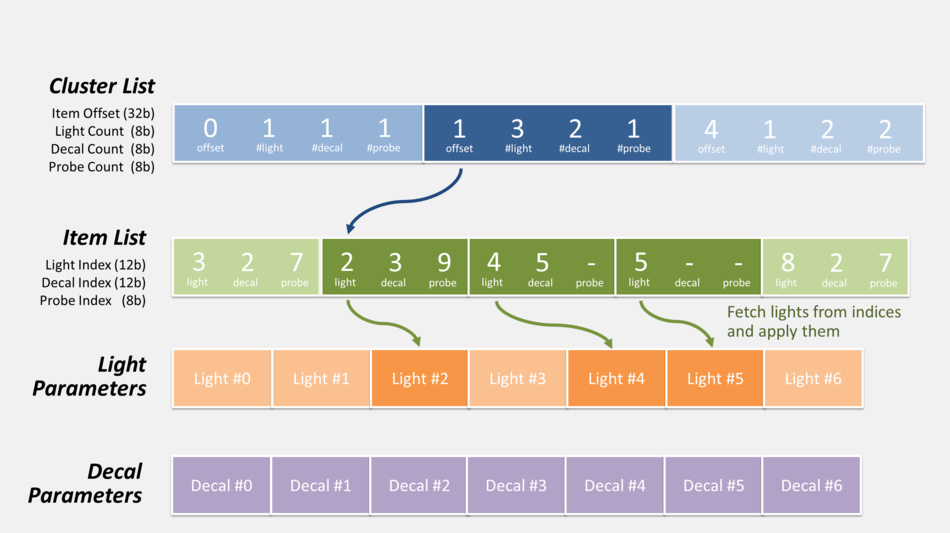

There’s also the probe list (not shown in the diagram above) which can be accessed in exactly the same fashion, but it’s not used in this pass so we’ll get back to it later. The overhead of pregenerating a list of items per cluster on the CPU is well worth it considering how dramatically it can cut the rendering calculation complexity on the GPU down the line. Clustered-forward rendering is getting some attention recently: it has the nice property of handling more lights than basic forward while being faster than deferred which has to write to / read from several *G-Buffers*.

But there’s something I haven’t mentioned yet: this pass we just examined is not simply a forward one writing to a lighting buffer; while it was performed 2 thin G-Buffers were also generated using [MRT](https://en.wikipedia.org/wiki/Multiple_Render_Targets):

[Untitled](5/Untitled%20Database.csv)

The normal map is stored in a R16G16 float format. The specular map is in R8G8B8A8, the alpha channel contains the smoothness factor. So DOOM actually cleverly mixes forward and deferred with a hybrid approach. These extra G-Buffers will come in handy when performing additional effects like reflections.

And last thing I omitted: a 160 x 120 feedback buffer for the mega-texture system was also generated at the same time. It contains information to tell the streaming system which textures at which mipmap level should be streamed-in. The mega-texture engine works in a reactive way: it’s after the render pass reports certain textures are missing that the engine loads them.

### GPU Particles

A [compute shader](https://www.opengl.org/wiki/Compute_Shader) is dispatched to update the particle simulation: position, velocity and lifetime. It reads the particle current states, as well as the normal and depth buffer (for collision detection), plays a simulation step and stores back the new states into buffers.

### Screen Space Ambient Occlusion

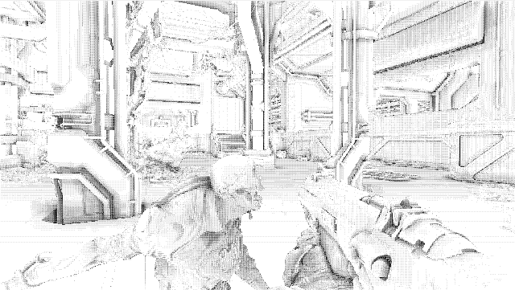

In this step the [SSAO](https://en.wikipedia.org/wiki/Screen_space_ambient_occlusion) map is now generated.

Its purpose is to darken the color around narrow seams, creases… It’s also used to apply [specular occlusion](http://research.tri-ace.com/Data/cedec2011_RealtimePBR_Implementation_e.pptx) to avoid bright lighting artifact appearing on meshes which are occluded.

It is computed at half the original resolution in a pixel shader reading from the depth buffer, normal and specular maps. The first result obtained is noisy.

### Screen Space Reflections

A pixel shader now generates the SSR map. It ray-traces reflections using only information present on-screen, making rays bounce on each pixel of the viewport, reading color of the pixels hit by them.

[Untitled](5/Untitled%20Database%201.csv)

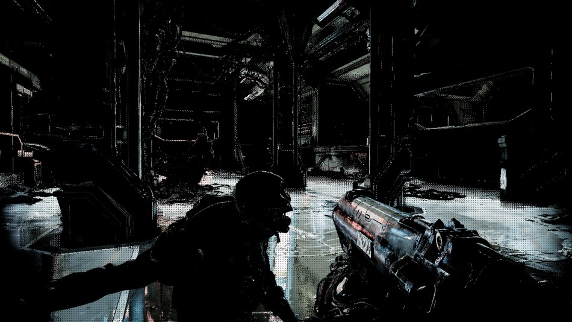

The inputs of the shader are the depth map (to calculate pixel world-space position), normal map (to know how to make the rays bounce), specular map (to know the ‘amount’ of reflection) and the ***previous frame*** rendered (at pre-tonemapping stage but post-transparency, to have some color information). The previous frame camera configuration is also provided to the pixel shader so it can keep track of fragment position changes.

SSR is a nice, not-so-expensive, technique to have real-time dynamic reflections happening in the scene for a constant cost, it really helps the feeling of immersion and realism. But it comes with its own artifacts due to the fact it works purely in screen-space and lacks “global” information. So you might be looking at nice reflections in a scene but as you begin to look downward, the amount of reflection decreases until there’s no reflection at all when you’re looking at your feet. I find the SSRs in DOOM well integrated, they improve the visual quality but are subtle enough you don’t notice them disappearing unless you’re really focusing on them.

### Static Cubemap Reflections

After all the dynamic reflections of the previous pass (and their limitations) now come the static reflections using [IBL](https://en.wikipedia.org/wiki/Image-based_lighting). The technique is based on pre-generated 128 x 128 cubemaps representing the environment lighting information at different locations of the map, they are also called “environment probes”. Exactly like the lights and decals we saw previously during the frustum clusterization, probes are also indexed the same way for each cluster. All the cubemaps of the level are stored within an array, there are several dozens of them but here are the 5 main contributors to this scene (the cubemaps within this room):

A pixel shader reads from the depth, normal, specular buffers, looks-up in the cluster structure which cubemaps influence the pixel (the closer the cubemap, the stronger its influence) and generates a static reflection map:

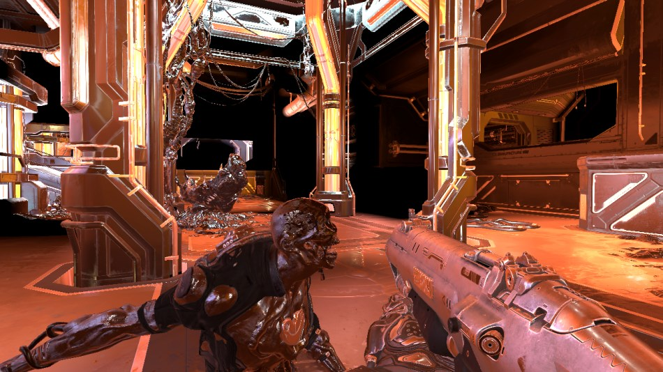

### Blending Maps Together

In this step a compute shader combines all the maps which were generated previously. It reads the depth and specular map, and blends the lighting of the forward pass with:

- the SSAO information
- the SSR when it’s available for the pixel in question
- when SSR information is missing, the static reflection map data is used as a fallback
- some fog effect is also computed

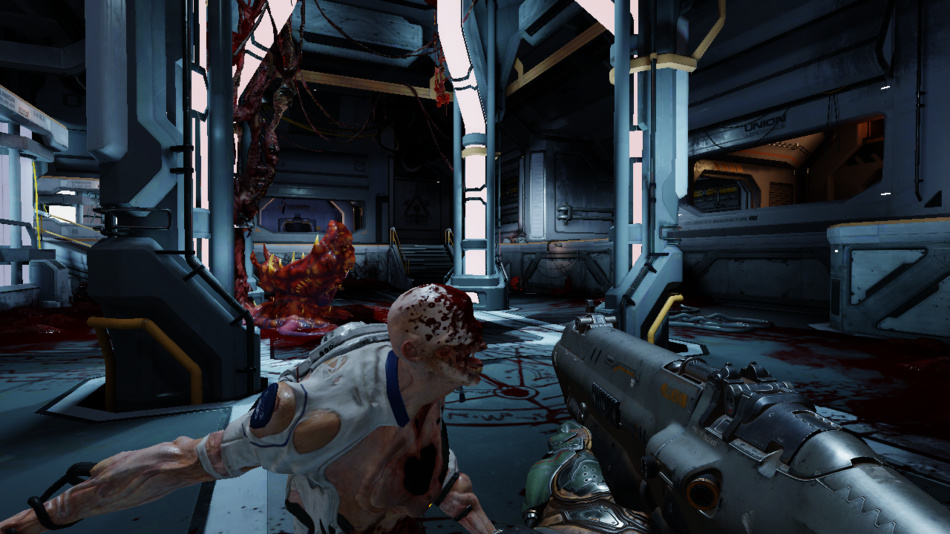

### Particle Lighting

We have some smoke particles in this scene and the lighting is actually calculated per sprite. Each sprite is rendered like if it was in world-space: from its position, some light list and their respective shadow maps are retrieved, and the lighting on the quad is calculated. The result is then stored into a tile of a 4k atlas, tiles can be of different resolution based on the particle distance from the camera, quality settings… The atlas has dedicated regions for sprites of the same resolution, here is an overview of 64 x 64 sprites:

And this is only the *lighting* information which is stored at such low resolution. Later when a particle is actually drawn, the full-resolution texture is used and the lighting quad is upscaled and blended with it. This is where DOOM decouples the particle lighting computation from the actual main rendering of the game: regardless of the resolution you’re playing at (720p, 1080p, 4k…) particle lighting is always computed and stored in these tiny fixed-size tiles.

### Downscale and Blur

The scene is downscaled several times, down to 40 pixels. The smallest downscaled levels are blurred using separated vertical and horizontal passes.

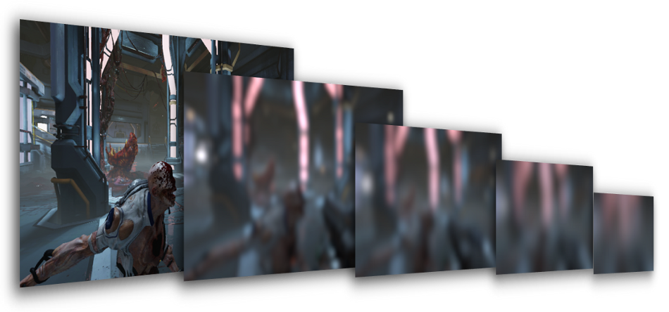

Why is this blur performed so early? Such process is usually done in the end during post-processing to make a bloom effect from the bright areas. But here all these different blur levels will come in handy in the next pass when rendering glass refraction.

### Transparent Objects

All the transparent objects (glasses, particles) are rendered on top of the scene:

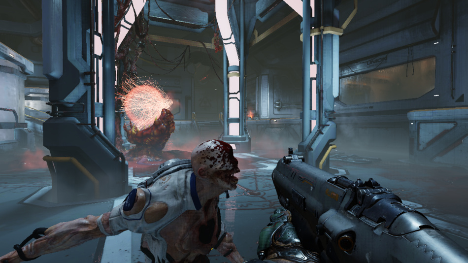

Glasses render very nicely in DOOM especially frosted or dirty glasses: decals are used to affect just some part of the glass to make its refraction more or less blurry. The pixel shader computes the refraction “blurriness” factor and selects from the blur chain the 2 maps closest to this blurriness factor. It reads from these 2 maps and then linearly interpolates between the 2 values to approximate the final blurry color the refraction is supposed to have. This is thanks to this process that glasses can produce nice refraction at different levels of blur on a per-pixel-basis.

### Distortion Map

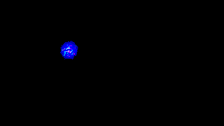

Very hot areas can create heat distortion in the image. Here the *Gore Nest* slightly distorts the image.

The distortions are rendered against the depth buffer to create a distortion map of low resolution. The red and green channels represent the distortion amount along the horizontal and vertical axis. The blue channel contains the amount of blur to apply.

The real effect is applied later as a post-process using the distortion map to know which pixels should be moved around. Although in this scene in particular it’s only a subtle distortion not really noticeable.

### User Interface

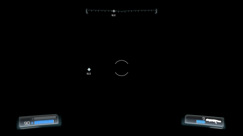

The UI is rendered to a different render-target, in premultiplied alpha mode stored in LDR format.

The advantage of having all the UI into a separate buffer, as opposed to drawn directly on top of the final frame, is that the game could apply some filter / post-processing like color aberration or visual distortion on all of the UI widgets at once in a single pass.

The rendering doesn’t use any batching technique in particular, it draws UI items one by one, in about 120 draw calls. In later passes, the UI buffer is blended on top of the game image to produce the final result.

### Temporal Anti-Aliasing and Motion-Blur

[TAA](https://en.wikipedia.org/wiki/Temporal_anti-aliasing) and [motion blur](https://en.wikipedia.org/wiki/Motion_blur) are applied using the velocity map and the rendering results of the previous frames. Fragments can be retroprojected so the pixel shader knows where the pixel currently being processed was located in the previous frame. The rendering actually slightly shifts meshes projection by half a pixel every other frame: this helps remove the sub-pixel aliasing artifacts.

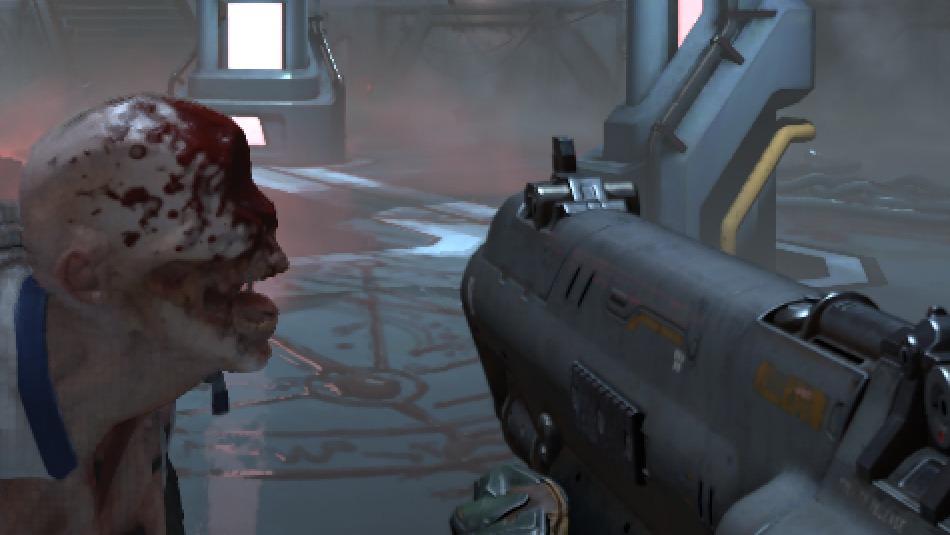

The result is very nice: not only the mesh edges become smooth, but the specular aliasing (where one bright pixel would pop-in alone for a frame) is also taken care of. The quality is far better than what could be achieved through a post-process method like FXAA.

### Scene Luminance

This step calculates the average [luminance](https://en.wikipedia.org/wiki/Luminance) of the scene, it is one of the parameters fed to the tonemapper later.

The HDR lighting buffer is downscaled to half its resolution in a loop until it becomes a 2 x 2 texture, each iteration calculates the pixel color value as the average of the luminance of its 4 parent pixels from the higher-resolution map.

### Bloom

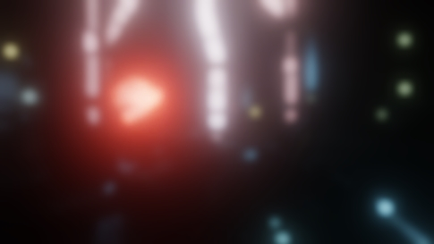

A bright-pass filter is applied to dim-down the darkest areas of the scene.

The result of the bright-pass filter is then downscaled in a loop and blurred in a similar process we saw previously.

Layers are blurred with a [Gaussian blur](https://en.wikipedia.org/wiki/Gaussian_blur) separated into a vertical and horizontal pass where a pixel shader calculates a weighted average along one direction.

Blurred layers are then combined to create the bloom which is an HDR texture at ¼th of the original resolution.

### Final Post-Processing

All this step is performed in a single pixel shader:

- heat distortion is applied reading the distortion map data
- the bloom texture is added on the top of the HDR lighting buffer
- effects like vignetting, dirt / lens flares are performed
- the average luminance is retrieved by sampling the center of the 2x2 luminance map and with additional exposure parameters, the tonemapping and color grading are applied.

The tonemapping takes the HDR lighting buffer containing colors varying inside a wide range of luminosity and converts it down to 8 bits per component (LDR) so the frame can be displayed on a monitor. A [filmic tonemapping operator](http://duikerresearch.com/2015/09/filmic-tonemapping-ea-2006/) based on the `(x(Ax+BC)+DE) / (x(Ax+B)+DF) - (E/F)` equation is used, it’s the [Uncharted 2 tonemapper](http://filmicgames.com/archives/75), also present in [GTA V](http://www.adriancourreges.com/blog/2015/11/02/gta-v-graphics-study/).

Note that all the general red tint of the scene comes from color correction.

### UI and Film Grain

Finally the UI is blended on the top of the game frame and at the same time a subtle [film-grain](https://en.wikipedia.org/wiki/Film_grain) is applied.

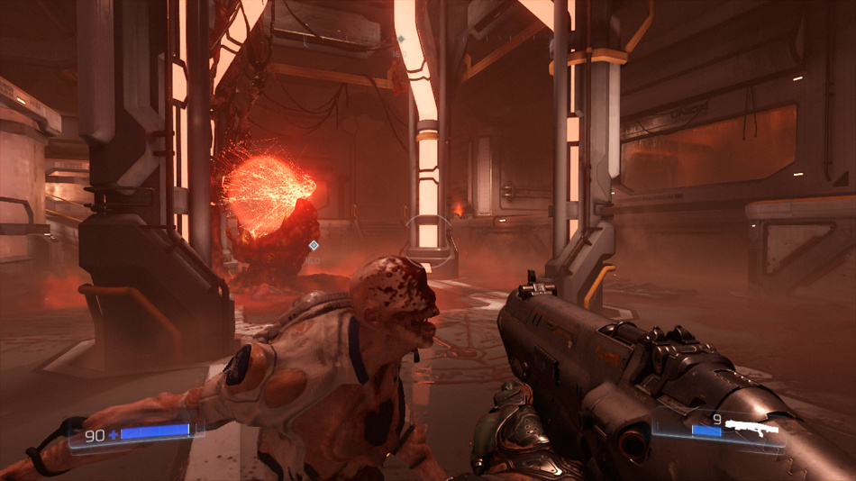

Phew! We’re done with the frame it can now be sent to the monitor for display, that was quite a lot of computation but all of this happened in less than 16ms. DOOM manages to produce great quality visual at high performance because it cleverly re-uses old data computed in the previous frames. In total there were 1331 draw calls, 132 textures and 50 render targets used.

### Close-Up on Glass

The glass rendering is really nice and it’s achieved with relatively simple steps as we saw before:

- prepare several levels of blur of the opaque meshes rendering
- draw translucent items back-to-front in forward mode applying decals / lighting / probe reflection, using the previous chain for different glass refraction blur values, so each pixel can have its own refraction value.

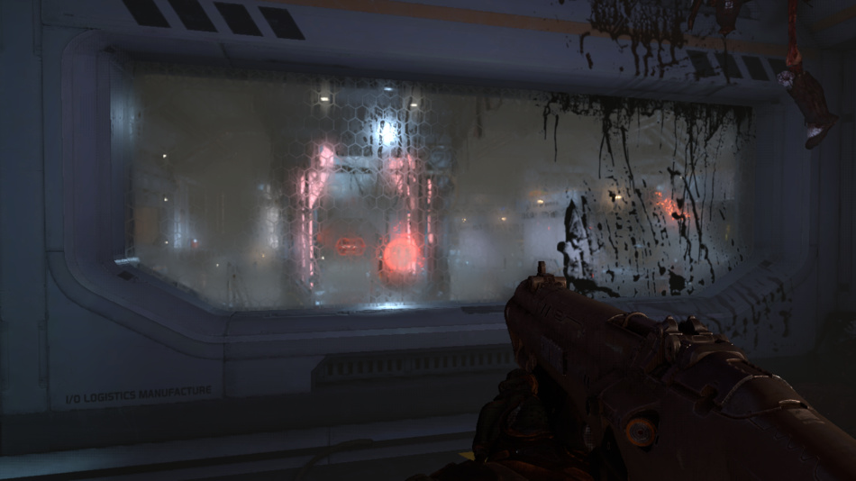

### Depth of Field

The frame studied in the breakdown didn’t really show any [depth of field](https://en.wikipedia.org/wiki/Depth_of_field) so let’s consider the following scene before and after the DoF is applied:

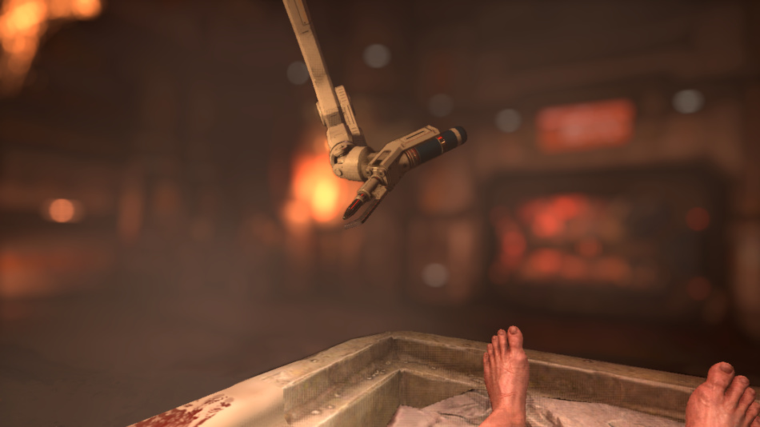

Not all games perform DoF correctly: the naive approach is often to use a Gaussian blur and do all the blurring in one pass depending on the pixel’s depth. This approach is simple and cheap but has several issues:

- while Gausian blur is good for bloom it’s not correct to create [bokeh](https://en.wikipedia.org/wiki/Bokeh): you really need a flat kernel to make the light of a bright pixel spread all around in a disk or hexagonal shape… A Gaussian can’t create nice bokeh shapes.
- performing DoF in a single shot of a pixel shader can easily lead to bleeding artifacts.

DOOM does DoF correctly and the approach chosen is in my experience among the ones which gives the best results:

Far-field and near-field images are created: pixel selection is done depending on its depth and on DoF parameters.

- Near-field can be strongly blurred, the more it’ll bleed into pixels behind it the better.
- Far-field is also blurred but doesn’t read any pixel from the in-focus / near-field area, so it avoids any problems with foreground objects wrongly bleeding into the background.

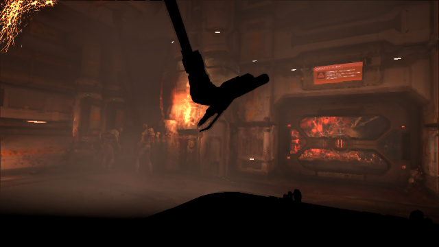

To create the bokeh blurs, DOOM works at half-resolution and performs a disk-blur with 64 texture taps, each sample having the same weight so the brightness really spreads around unlike a Gaussian blur. The disk diameter can vary on a per-pixel basis depending on the pixel’s [CoC](https://en.wikipedia.org/wiki/Circle_of_confusion) value.

It then extends further the blurring with a 16-taps blur, but this time it does not compute a weighted-average, it simply accumulates the sample values and keeps the highest value of the neighbor taps, so not only does this widen the first blur it also fixes the small artifacts (gap in sampling) of the first pass. This last part is inspired by [McIntosh’s work](http://ivizlab.sfu.ca/papers/cgf2012.pdf). Such technique of iteration over several passes can produce very nice large blurs while still remaining efficient performance-wise, the number of actual texture taps performed per pixel is still quite low considering the wide radius of the final disk-blur obtained.

Far and near-field images are finally composited on the top of the original scene with alpha blending to create the final depth of field effect. This pass is performed just before applying the motion blur.

If you want to dive deeper into idTech 6 technology there are fortunately a lot of speeches and public materials available:

- [The devil is in the details: idTech 666](http://advances.realtimerendering.com/s2016/Siggraph2016_idTech6.pdf) (Siggraph 2016) by Tiago Sousa and Jean Geffroy
- [Tech Interview: Doom](http://www.eurogamer.net/articles/digitalfoundry-2016-doom-tech-interview) by Digital Foundry
- [Doom: The definitive interview](http://venturebeat.com/2016/06/17/the-definitive-interview-on-the-making-of-doom/) by VentureBeat
- [Graphics Gems CryEngine 3](http://www.crytek.com/download/Sousa_Graphics_Gems_CryENGINE3.pdf) (Siggraph 2013), many post-process techniques are used in idTech 6.

Further discussion on this topic: [Slashdot](https://games.slashdot.org/story/16/09/12/0131217/a-very-detailed-dissection-of-a-frame-from-doom), [Hacker News](https://news.ycombinator.com/item?id=12461896), [Reddit](https://www.reddit.com/r/Games/comments/51x6mh/doom_the_process_of_rendering_a_frame/), [Kotaku](https://kotaku.com/picking-apart-a-single-frame-in-doom-1786480772).
