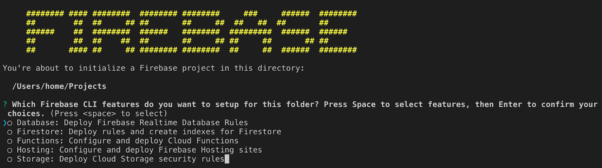
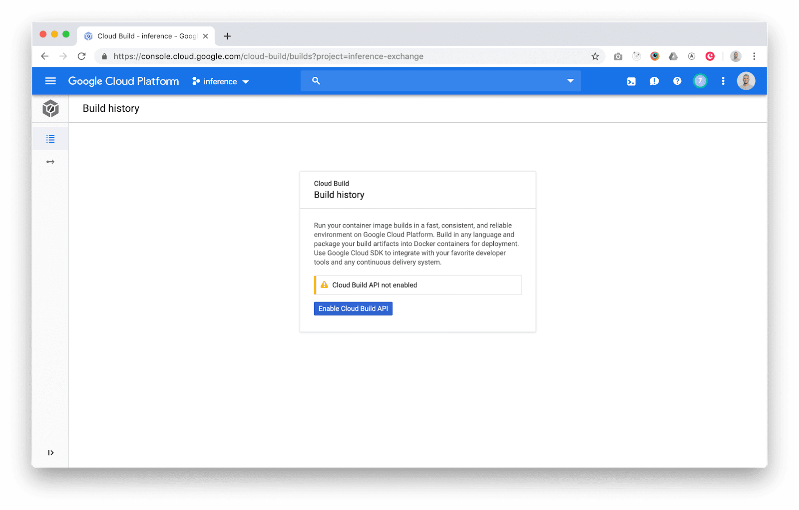
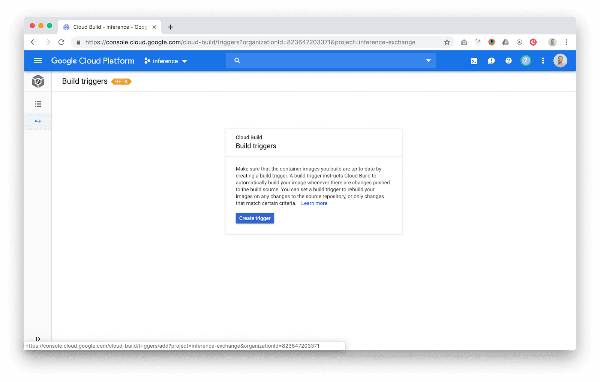
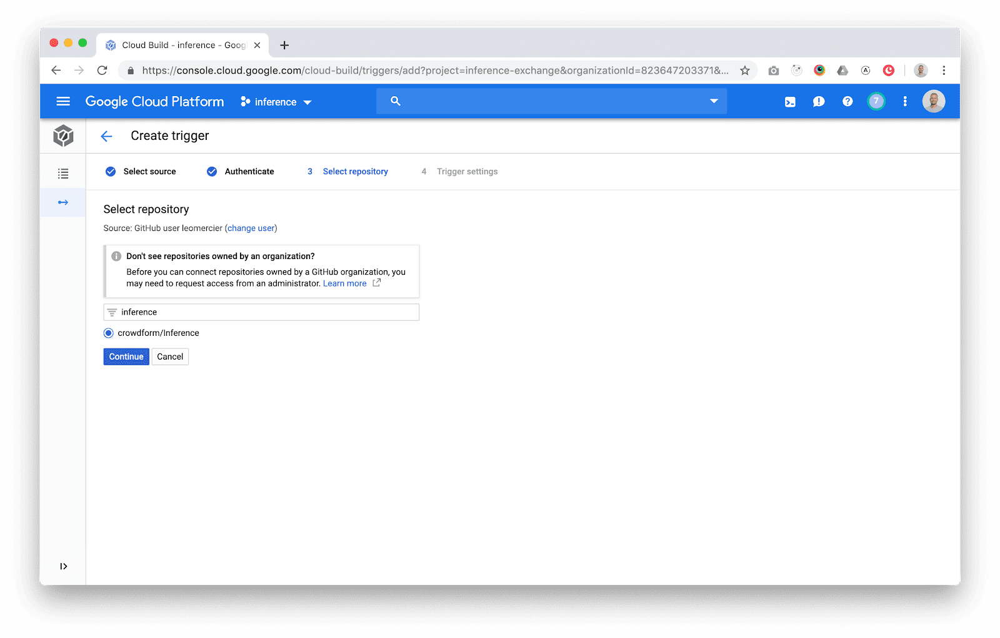
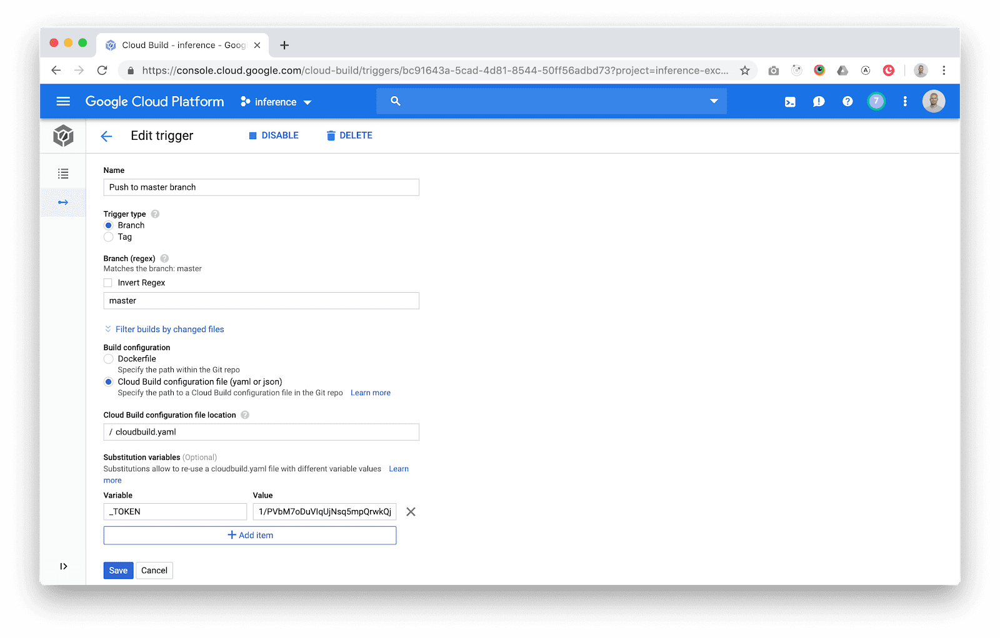
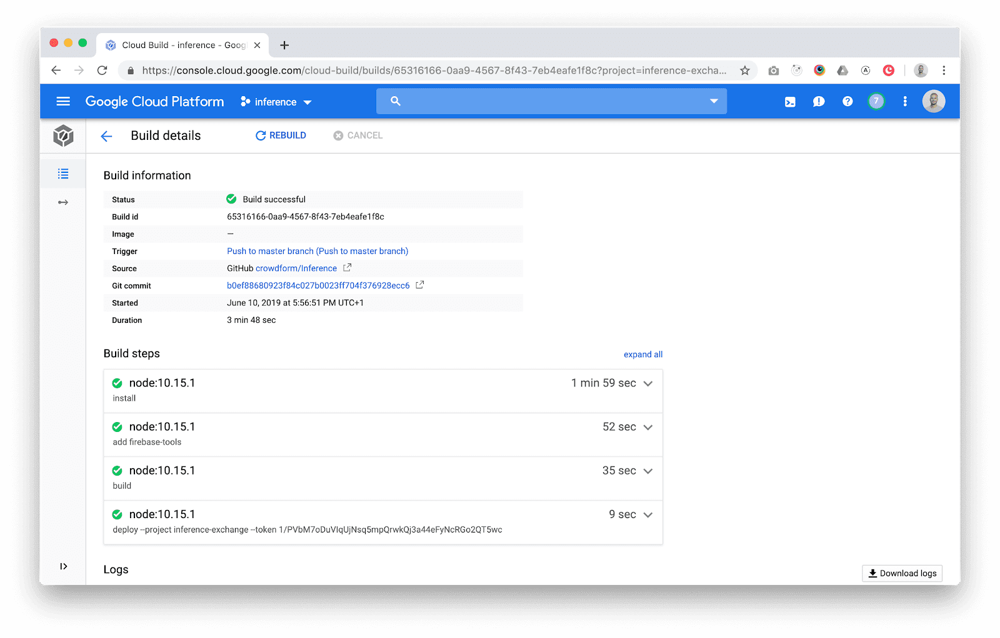

Over the last couple of months we've been paying close attention to GatsbyJS. It promises to finally sort out some of of the issues that have stopped us using other static site generators. Most notable is Progressive Web App (PWA) support and the ability to run a headless Wordpress instance to provide all the site content. Reading around on sites like Dev.to there are a lot of tutorials about hosting Gatsby sites on Netlify but little for Firebase.

Alongside the switch to Gatsby, we've also started migrating some of our [digital products](https://www.crowdform.co.uk/blog/what-is-a-digital-product) over to the Google Cloud Platform. Previously we relied on a fragmented set of platforms based on Heroku and the plethora of add-ons needed to run a simple NodeJS app in production. We're finding Google Cloud provides a more complete solution and better integration between all their services ideal for micro service architecture. Support for Kubernetes is also very useful - but that's for another blog post.

1. [Crowdform](https://www.crowdform.co.uk/): we're in the process of switch our site over to Gatsby

Some of the recent sites we have built with Gatsby:

1. [Instructor List:](https://inference.exchange/) platform for booking classes with the best dance teachers across London
2. [Mason & Fifth](https://www.crowdform.co.uk/work/mason-fifth): London co-living spaces driven by personal wellbeing and inspired by community (coming soon)

## Prerequisites

1. Project in GitHub, Bitbucket or Google Cloud Source Repository
2. Google Cloud Account with billing enabled (you will not be charged as the limits on Cloud Build are generous and Firebase Hosting is free. Cloud Build gives you the first 120 builds-minutes per day free)
3. Google Firebase Project & Google Cloud Build API enabled

## Setting up Firebase

### 1. Install the Firebase CLI

`npm install -g firebase-tools`

### 2. Authenticate Firebase

`firebase login`

This will open the browser window for you to login, once complete close this and head back to your terminal.

### 3. Initialize your Firebase project

`firebase init`

Firebase CLI Setup

You should now see the above in the terminal, navigate with your keyboard arrows to “Hosting: Configure and deploy Firebase Hosting sites” and press the [space] bar to tick the option followed by [enter].

You can now select or create your Firebase project which is associated to the files.

In Gatsby by default all generated files are output to the /public directory. Firebase should detect this and fill in the “What do you want to use as your public directory? (public)” for you.

The next step Firebase CLI will ask “Configure as a single-page app?” make sure you answer no (N) to this as Gatsby will generate all the URL paths for you as provides Server side rendering out of the box.

### 4. Initialize your Firebase project

`yarn build or gatsby build`

The above makes sure we have something to host from Gatsby and updates the build with any changes that have been carried out.

`firebase deploy`

The last step is to check the deployment manually, if everything is correct this will complete and output a default Firebase domain. Firebase do now give you a free domain normally (projectname).web.app but you can [add your own domain](https://support.google.com/firebase/answer/9137747?hl=en) or further configure it through the [Firebase Console](https://console.firebase.google.com/).

## Setting up Google Cloud

Navigate to Google Console Cloud Build and enable the API (billing will need to be enabled on the account but you should be with in the free limits of 120 minutes a day with a Gatsby Static Site).

Google Cloud Build Screenshot

### 1. Add a build trigger

Add a build trigger to Google Cloud Build

### 2. Link a Git Repo

Options are GitHub, Bitbucket or Google’s own cloud source repo. Then select a trigger branch, normally this is master. When there is a push or merge on this branch this will now trigger the cloud build to run.

Google Cloud Build Screenshot

## Cloud Build Build Instructions YAML file.

All the config for how to build and deploy our Gatsby site will live in the cloudbuild.yaml file in your Git repo.

The essence of it is:

1. Use a Yarn & Node virtual machine
2. Install all dependencies
3. Install Firebase-cli (normally installed global on a local machine)
4. Run the Gatsby build function and generate the static site to /public
5. Push the contents of the public folder to Firebase Hosting.

Create a file cloudbuild.yaml in the root of your project and copy across the below Gist into the YAML file.

    steps: 
      - name: node:10.15.1 
        entrypoint: yarn 
        args: ["install"] 
      - name: node:10.15.1 
        entrypoint: yarn 
        args: ["add", "firebase-tools"]
      - name: node:10.15.1 
        entrypoint: yarn 
        args: ["build"] 
      - name: "node:10.15.1" 
        entrypoint: "./node_modules/.bin/firebase" 
        args: ["deploy", "--project", "$PROJECT_ID", "--token", "$_TOKEN"]

## Authorising Firebase

You’ll notice from the YAML file that there is “ $_TOKEN” in the Firebase deploy command. With CloudBuild there is a feature called variable substitution that when the build runs these will be substituted with config specified in the build trigger. We will use this to pass the firebase authorization token so that the site can be deployed.

To retrieve your Firebase access token On your local machine and within the project directory run the follow command, this allows firebase to work with continuous integration systems and will return a token to be saved in the trigger settings.

`firebase login:ci`

(An alternative approach is to authorise using service accounts but this is slightly more complicated.)

Once you have the token, under the “Substitution variables” add the key value:

`_TOKEN : {firebase generate token}`

Google Cloud Build Screenshot Substitute variables

## Testing Deployment and Publish Site

After following all the steps you can manually test the trigger - running the build process. In the trigger list select “Run Trigger”.

You'll be able to check its progress in the "History" tab.

Google Cloud Build Screenshot Success

On build successful your Firebase site will be deployed.

## And finally

If you need further help reach out to me on [leo@crowdform.co.uk](mailto:leo@crowdform.co.uk)
