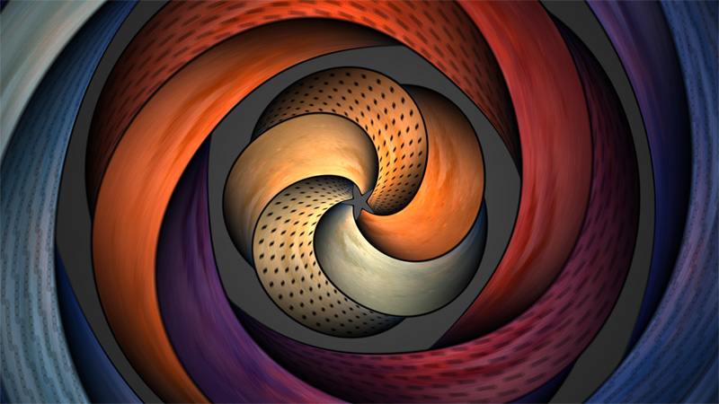

### Intro

When doing procedural graphics it's always a good idea to add color variation to the elements of the image. From grass blades, to grass clumps, to rocks or trees or hills, all scales of detail benefit from some color variation. In order to achieve this, one can employ different methods of course, but among the cheapest and the most coder-friendly ones there are those based on simple (hard)coded formulas. Usually these color variations will be subtle but important, and can be achieved by employing a color palette that modifies the base color of the element (blade of grass, rock, or whatever it is). A simple addition or modulation (multiply) will suffice - more often than not there's no need to go the route of converting the color to HSV and doing hue or saturation manipulations in that space before converting back to RGB.

Creating procedural palettes is also interesting to colorize signals that are gray scale and don't have natural colorization, such as density plots or fractals. This article is about one posible way to compute such palettes for modulation or visualization in a cheap way - as said, with a simple formula.

Simple procedural color palette (

### The idea

One of the simplest formulas or expressions possible is the cosine of a linear argument. Popular wisdom (especially between old-school coders) is that trigonometric functions are expensive and that therefore it is important to avoid them (by means of LUTs or linear/triangular approximations). Often popular wisdom is wrong - despite the above still holds true in some especial cases (a CPU heavy inner loop) it does not in general: for example, in the GPU, computing a cosine is way, way faster than any attempt to approximate it. So, lets take advantage of this and go with the straight cosine expresion:

color(t) = a + b ⋅ cos[ 2π(c⋅t+d)]

It can't get any simpler. As **t** runs from 0 to 1 (our normalized palette index or domain), the cosine oscilates **c** times with a phase of **d**. The result is scaled and biased by **a** and **b** to meet the desired constrast and brightness.

Of course, in order to get hue variation the four parameters **a**, **b**, **c** and **d** must be vectors of three components (red, gree, blue). If you need to ensure the palettes cycle over the 0..1 interval exactly, then you'll need to make **c** an integer number of halves (0.0, 0.5, 1.0, 1.5, 2.0, ...). If you worry about C1 continuity, then make **c** an integer (and you'll get infinite degree continuity in fact).

### Some examples

The amount of color variations is not bad given the simplicity of the method. All the palattes produced by the above formula have the same rythm, but it's just good enough for too many purposes:

[Untitled](9/Untitled%20Database.csv)

These are some examples of some of these palettes used to achieve color variation of a base color or for direct visualization of scalar quantities:

[https://www.shadertoy.com/view/lsfGDB](https://www.shadertoy.com/view/lsfGDB)

[https://www.shadertoy.com/view/XdjXWK](https://www.shadertoy.com/view/XdjXWK)

[https://www.shadertoy.com/view/Mdl3RH](https://www.shadertoy.com/view/Mdl3RH)

### Implementation

The code follows trivially from the formula described above:

// cosine based palette, 4 vec3 params vec3 palette( in float t, in vec3 a, in vec3 b, in vec3 c, in vec3 d ) { return a + b*cos( 6.28318*(c*t+d) ); }

Here you can see the technique working in realtime - you can edit the numbers to create your own new palettes (click in the title in order to jump to the source code):
